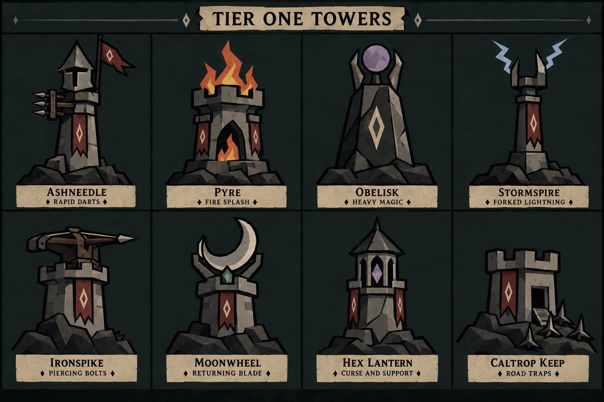

# App Style Theme

## Purpose and reference images

For the user's concise generation guide, read
[IMAGE_GENERATION_INSTRUCTIONS.md](IMAGE_GENERATION_INSTRUCTIONS.md). It describes
the visual style directly and covers palette, alignment, tier progression,
practical construction and preservation of approved designs.

**Hollow Vigil image-asset reference · September 16, 2026**

Read this document before generating, editing, or commissioning image assets for
the game. It describes the shared visual language of the two user-supplied images
below, so a new subject can belong to the same world without copying their exact
compositions. It applies to characters, enemies, towers, buildings, equipment,
props, terrain, scenery, backgrounds, illustrated emblems, and visual effects.

This is an **art direction and image-generation reference**, not a UI
specification. Controls, typography, screen layouts, and interface measurements
belong in [UI_THEME.md](UI_THEME.md) and [UI_STYLE_GUIDE.md](UI_STYLE_GUIDE.md).
Do not apply fixed UI border widths to artwork.

### Reference A: tier-one towers



The original supplied file was `exec-3ae0bae4-99e3-4286-a3d0-1d42422d072b.png`.
The unchanged repository copy establishes how varied objects share one style:
chunky cut-stone construction, heavy black contours, faceted surfaces, pale
diamond insignia, muted red pennants, dark rock foundations, and small purposeful
colors for fire, lightning, crystals, and magic. Its grid, title, lettering, and
nameplates organize a reference sheet; they are not default elements of an asset.

### Reference B: Pickard in the moonlit world


The supplied `pickard-menu-background.png` matches this repository image. It
establishes character treatment, atmosphere, landscape depth, value balance,
weathering, and emotional tone. A pale moon silhouettes ruined fortifications;
the foreground knight remains legible through broad light armor planes and deep
black separations. The world is dark without making every shape indistinguishable.

Use both images together: A clarifies asset construction and family consistency;
B clarifies the world those assets inhabit. For future image generation, this
document and these two references take precedence over older art notes prescribing
pastel palettes or completely textureless primitives. The original
[Pickard character reference](../assets/ui/pickard-reference.jpg) also remains
useful for his identity. [ART_DIRECTION.md](ART_DIRECTION.md) retains implementation
and historical context. Existing gameplay, content identities, and shipped images
are not changed merely by adopting this reference.

## 1. The style in one paragraph

Create a **stylized 2D dark-medieval-fantasy illustration with heavy ink contours,
angular cut-paper-like silhouettes, broad matte color planes, selective faceted
shading, and subdued weathered print texture**. Build the world from charcoal
greens, soot black, warm stone gray, dull iron, aged bone, and worn oxblood cloth.
Use simplified but substantial forms: stout masonry, layered armor plates,
sharply cut rocks, pointed roofs, torn pennants, and sparse geometric heraldry.
Light and depth come primarily from carefully arranged values, overlapping
shapes, and restrained atmospheric layers. The feeling is solemn, ancient,
isolated, and quietly heroic, with small signs of fire or magic inside a heavy,
material world.

## 2. Theme, mood, and emotional character

The setting suggests a ruined border kingdom under a long night: old keeps,
watchtowers, abandoned battlements, weathered standards, rocky highlands, dark
conifers, and remnants of battles or burials. Defenders and structures feel built
to endure. Stone, iron, wood, and heavy cloth carry the setting more than lavish
ornament or elaborate lore symbols.

The emotional center is **vigilance and endurance**. Pickard stands planted and
guarded. Towers look purposeful and weight-bearing. Broken stone and frayed
fabric imply age and hardship while the intact silhouettes imply resolve.
The tone is austere, melancholy, mysterious, and imposing. It can accommodate
danger and supernatural forces without turning every image into a horror scene.

Keep this emotional restraint when illustrating action. A weapon strike can be
forceful, a creature threatening, or a spell active while the image retains its
limited palette and clear geometry. Cute expressions, comic exaggeration, festive
color, excessive gore, and triumphant golden spectacle are not the default mood.
The graphic simplification is storybook-like, but its weight and atmosphere are
adult and somber.

## 3. Palette and color relationships

### Representative color targets

The hex values below are **approximate art-direction targets interpreted from the
references**, not an exhaustive pixel extraction or mandatory exact-color list.
Weathering and facet variation naturally produce nearby shades. Preserve the
relationships between colors more faithfully than any individual hex value.

| Color family | Representative values | Role in an image |
| --- | --- | --- |
| Ink and deepest voids | `#080A09`, `#101412` | Silhouette contours, visor gaps, deep recesses, contact shadows |
| Charcoal-green night | `#151E1D`, `#1C2725` | Sky, broad dark backdrop, shield faces, distant shadow masses |
| Forest and mist slate | `#293633`, `#3B4843`, `#4B5750` | Receding hills, trees, ruins, quiet atmospheric layers |
| Dark rock and iron | `#292B28`, `#41423C`, `#56564E` | Boulders, shaded armor, tower sides, foundations |
| Weathered warm stone | `#6D6B60`, `#8B8778`, `#A19A88` | Masonry faces, worn iron highlights, carved surfaces |
| Bone and parchment moon | `#BFB295`, `#D1C19F`, `#DDD0AF` | Moon, blade edges, pale metal, insignia, crescent forms |
| Faded oxblood cloth | `#392724`, `#613B34`, `#79473A` | Cloaks, banners, cloth shadows and folds |
| Old timber and leather | `#3D3025`, `#624B35`, `#7C6347` | Bow stocks, bindings, belts, shafts, structural wood |
| Tarnished bronze | `#6B523A`, `#8E7452` | Small clasps, fittings, rivets, restrained metal details |
| Ember and ochre fire | `#A7462C`, `#C56332`, `#D5A447` | Angular flame layers and compact warm effects |
| Dusty violet | `#514455`, `#786382`, `#9783A0` | Magic stones, orb facets, suspended crystals |
| Storm blue-gray | `#758F9E`, `#A6B9C5` | Forked lightning and cold elemental accents |
| Muted mineral green | `#45604E`, `#70836C` | Small inset gems and occasional supernatural accents |

### How to distribute color

Most of a scene belongs to dark neutral and green-gray families. Midtone stone
and iron describe the subject; bone-colored highlights draw attention. Red cloth
is a controlled identity accent rather than a large vivid wash. Saturated-looking
fire and cool magic work because they occupy small, isolated areas surrounded by
subdued materials.

For a full scene, a useful starting composition is roughly two-thirds dark
atmosphere and shadow, with the remaining space divided between material
midtones, pale focal shapes, and a small amount of accent color. This is a
generation heuristic, not a measured ratio or a rule for isolated assets.
A stone tower on transparency may naturally contain much more midtone gray.

Use a small material palette within each object: a base tone, a darker plane,
a lighter plane, and perhaps one intermediate worn patch. Avoid giving every
component an unrelated color. Cool green darkness against warm gray stone and
bone produces much of the references' character. Avoid clean white highlights,
bright primary red, electric cyan, saturated grass green, candy purple, and
golden-yellow surfaces dominating an otherwise ordinary asset.

## 4. Shape language, silhouette, and proportions

The fundamental vocabulary is **wedges, tapered slabs, broken rectangles,
trapezoids, irregular polygons, long diamonds, triangles, and pointed arches**.
Forms feel carved, forged, cut, or assembled. Edges often change direction at
decisive angles. Masses are simple enough to recognize in silhouette, then
subdivided to explain their construction.

- **Characters:** broad shoulders, substantial torso and limbs, large readable
  armor plates, clearly separated hands, weapon, shield, and feet. Pickard has
  heroic weight without a tiny body or oversized cartoon head.
- **Towers:** upright shafts, slightly irregular or tapered bodies, thick collars,
  broad parapets, and stable foundations. Their identifying mechanism projects
  clearly beyond or above the body.
- **Rocks:** interlocking angular masses with a few contrasting planar faces.
  Avoid smooth pebbles, uniformly triangulated meshes, or piles of identical blocks.
- **Cloth:** broad overlapping fold shapes, sharp directional creases, pointed
  tears, and forked or ragged hems. Cloth remains flexible but graphically angular.
- **Vegetation:** narrow trunks, triangular conifer masses, spear-like grass
  tufts, and sparse jagged branches. Foliage reads as grouped silhouettes.
- **Ruins:** blocky broken skylines, gaps, teeth-like battlements, pointed openings,
  interrupted walls, and irregular heights.

Curves are selective accents, not forbidden: the moon is a calm circle; the
Obelisk's orb is rounded and faceted; Moonwheel has a broad crescent; clasps can
be circular. These simple curves contrast with the angular world. Do not force
every circle into a sharp polygon or soften every silhouette into a rounded blob.

Use modest hand-shaped irregularity. A roof, stone, or cloak edge may be uneven,
but it should still feel intentional and structurally plausible. Keep the main
design stable; use asymmetry for age, stance, torn cloth, and damage.

## 5. Contours and interior marks

Foreground subjects have bold black or near-black outer contours. The contour
gives weight and separates neighboring materials. Deep joints, undersides,
openings, and plate overlaps also use strong black shapes, so the ink participates
in construction rather than acting only as an outline around a colored sticker.

Outer silhouettes and major overlaps are strongest. Internal seams are fewer
and generally lighter in visual weight. Many facets meet through a color change
alone; outlining every facet creates a stained-glass or wireframe effect absent
from the references. Use tapered cracks, angular nicks, and short worn marks.
Avoid dense crosshatching, hairline technical drafting, scribbly sketch lines,
or repeated ornamental strokes covering every surface.

Contour weight scales with subject size and intended output. It should remain
visible when reduced without swallowing a small opening, narrow blade, or face.
There is no universal pixel or UI-unit measurement for art. Distant scenery often
uses unoutlined tonal silhouettes; giving every background tree the same black
rim as the foreground hero destroys depth.

## 6. Simplicity and detail hierarchy

The art is **simple in organization and selective in detail**. It is neither
empty vector clip art nor a densely rendered realistic painting. The viewer
should first see the whole subject, then its functional parts, then its age.

Use three levels of information:

1. **Primary:** the silhouette and two or three dominant masses, such as a tower
   shaft and its weapon, or a knight's armor, cloak, and shield.
2. **Secondary:** overlapping plates, a collar, battlements, an arched opening,
   a timber brace, a banner, or a few broad cloth folds.
3. **Tertiary:** sparse chips, cracks, mottling, scuffs, and small facets.

Remove tertiary detail before compromising the first two levels. At thumbnail
size the object should still be identifiable. At close range it should reward
inspection with restrained construction and wear, not a uniform field of noise.
Leave some large surfaces quiet. Do not draw every masonry block, chain-mail
ring, wood fiber, leaf, or stitch merely because the material could contain it.

## 7. Rendering, shading, and texture

Build volume with broad, hard-edged planes of color. A slab may have a lighter
front, a darker side, and a nearly black underside. Armor, rocks, and crystals
can contain a handful of angular patches that imply facets. These patches follow
form and lighting; they are not randomly scattered triangles.

The result resembles a textured graphic illustration with cut-paper and
woodcut-like qualities. Those comparisons describe shape and print character,
not literal paper collage, embossed craft material, or dense engraved hatching.
Likewise, "faceted" describes painted shapes, not permission to make a glossy
low-poly 3D render.

Textures are matte, irregular, and low contrast: fine grain, faint cloudy stains,
uneven pigment, shallow scuffs, small chips, and localized dirt. The moon has
mottled parchment-like variation; stone and armor have subdued roughness; cloth
has faded patches. Texture sits within established shapes and should not fuzz
their edges or reduce legibility. Bare transparent space has no paper texture.

A scene may use quiet tonal transitions in sky or mist. Keep object volume
primarily planar. Avoid airbrushed modeling, polished specular highlights,
photographic surface maps, plastic shine, chrome reflections, visible digital
brush swirls, heavy canvas weave, extreme grunge, or sepia filters flattening all
materials into one brown color.

## 8. Material vocabulary

| Material | How it should look |
| --- | --- |
| Iron armor and metalwork | Thick, dull, warm gray plates with beveled-looking painted planes, dark joints, pale worn edges, and occasional nicks. Highlights are flat shapes, not glossy reflections. |
| Stone and masonry | Weighty gray-brown blocks, broad faces, dark recesses, a few seams or fractures, chipped corners, and clear load-bearing mass. Avoid covering the structure with tiny bricks. |
| Natural rock | Dark charcoal clusters with irregular silhouettes, slanted planes, sharp fracture lines, and strong contact shadows. Faces vary enough to separate neighboring rocks. |
| Cloth | Heavy faded oxblood or dark green fabric, broad angular folds, nearly black fold interiors, torn pointed edges, and sparse abrasions or holes. No silky sheen. |
| Wood | Dark desaturated brown structural pieces, simple tapered grain hints, blunt cuts, iron bands, and functional joins. Keep the object stronger than its grain texture. |
| Leather | Muted brown belts and bindings, thick readable strips, a few edge variations, small restrained buckles. |
| Bone, ivory, and pale carved forms | Warm chalky cream, slight discoloration, clear edge shape, subdued facets. Avoid pristine white enamel. |
| Gems and magic stones | Compact violet or mineral-green forms with a few large facets, a dark setting, and one restrained lighter face. They remain solid objects rather than tiny suns. |
| Old fittings | Tarnished bronze or muted brass in small quantities; simple discs, rivets, clasps, and brackets rather than ornate gold filigree. |

## 9. Lighting, values, and atmosphere

The Pickard scene uses a warm pale moon against a cold charcoal-green night.
Dark foreground rocks frame the knight. Midtone armor and bone-colored weapon
edges keep him visible; the red cloak separates him from green-gray surroundings.
The moon provides a large light shape behind the subject and ruins, not a broad
white bloom or a luminous halo around every edge.

Interpret lighting graphically. Select a coherent light direction, emphasize
some upper or facing planes, and keep recesses dark. It need not simulate exact
physical illumination to communicate form. An isolated tower should remain
readable in neutral dim light without requiring a moon behind it.

Depth comes from overlap, scale, and compressed contrast:

- Foreground objects are darkest, sharpest, most textured, and most strongly inked.
- The focal subject carries the clearest important material separations.
- Middle-distance ruins, trees, and slopes use simplified dark green-gray forms.
- Farther terrain approaches the atmospheric background color and loses internal
  detail and edge contrast.

Use flat elongated cloud shapes and thin mist bands as quiet horizontal breaks.
Keep distance atmospheric through layered values rather than photographic lens
blur. Avoid cinematic lens flare, excessive rim light, volumetric spotlights,
strong bloom, sparkling dust, or a haze that makes all silhouettes equally soft.

## 10. Composition and viewpoint

Reference A presents towers with a mostly frontal, slightly elevated view that
reveals a few top and side planes. The perspective is simplified and consistent,
not a technical isometric grid. Each tower has room around its mechanism and a
wide dark foundation that makes it feel grounded.

Reference B uses a dominant upright figure, large moon offset behind him,
receding ruins, and overlapping diagonals of terrain. Repeated verticals from
trees, towers, swords, and banners echo the knight. Horizontal cloud strips and
the circular moon provide contrast. Quiet sky and darker ground give the main
subject breathing room.

For new images, choose a view that communicates the requested subject and fits
its destination. Reuse the perspective of neighboring production assets when
replacing one. Do not copy the knight's exact pose, the moon placement, the tower
sheet's grid, or the portrait background's proportions into every commission.
The asset request determines framing and aspect ratio. Game screen backgrounds
follow the app's upright portrait format; square sprites, wide scenery artwork,
and review sheets can use their appropriate formats.

Preserve the whole important silhouette unless a close crop is requested. Leave
room for tall spires, bow tips, flames, weapons, and feet. Keep openings and gaps
large enough to survive reduction. For isolated assets, use transparent space
with clean edges and retain a ground base only if the asset calls for one; a
cutout does not need a rectangular chunk of dark sky behind it.

## 11. Repeating motifs and visual identity

The most distinctive recurring emblem is a **long pale hollow diamond**, sometimes
with a dark center cutout, on shields, banners, and stone. Other useful motifs
include pointed arches, spear tips, forked pennant tails, crenellated crowns,
crescents, simple clasps, and suspended geometric crystals.

Repeat motifs sparingly and with purpose. One strong emblem usually communicates
identity better than a surface covered in runes. Use the diamond where faction
or design continuity calls for it, not indiscriminately on every animal, plant,
and stone. Keep heraldry broad and legible, with natural material wear.

When depicting **Pickard specifically**, retain the closed angular greathelm,
deep black cross-like visor, broad gray armor, muted red torn cloak, sturdy
sword, and dark kite-shaped shield with its pale elongated diamond. His face
stays concealed unless the request explicitly changes that identity. Poses and
settings may change; the grounded, guarded presence and recognizable equipment
remain. Other characters should share the art language without becoming copies
of his outfit or silhouette.

## 12. Applying the style to different assets

### Towers and buildings

Use a family of compatible stone, iron, timber, cloth, and rock parts. Give each
structure one immediately readable purpose or dominant feature. Reference A
demonstrates eight distinct silhouettes within that family:

| Reference subject | Distinguishing visual idea |
| --- | --- |
| Gloamwatch | Dark pointed watchtower, black firing windows, compact rubble; flags and fortification added by tier |
| Pyre | Crenellated furnace tower with a black pointed arch and angular layered flames |
| Obelisk | Tall faceted dark monolith, pale diamond, claw-like supports, and violet orb |
| Stormspire | Slender shaft, forked metal crown, and pale zigzag lightning |
| Ironspike | Stout crenellated pedestal carrying a broad wooden-and-iron bow |
| Moonwheel | Upright pale crescent held above a short tower with a small green inset |
| Hex Lantern | Pointed canopy and open stone housing around a suspended violet crystal |
| Caltrop Keep | Compact battlemented keep, dark doorway, small stairs, and sharp ground spikes |

These are examples of differentiation, not instructions to add those objects to
every image. For new structures, express function through silhouette before
adding decoration. For a higher tier, strengthen or extend the recognizable
construction instead of burying it under spikes, gems, and filigree. Visual
changes do not invent gameplay behavior or alter the content brief.

### Tower foundations: reusable prompt

For future tower artwork, include a restrained buildup of crumbly stone around
the foot of the structure, as in the approved Gloamwatch concept. Let a few
irregular rocks and broken masonry pieces build into the lower walls, then
taper into smaller fragments toward the ground. Keep the rubble low and close
to the tower so it settles naturally into the terrain without becoming a large
mound, cliff, pedestal, or scenery tile. Preserve entrances, placement clarity,
and the tower's readable silhouette; do not enlarge gameplay footprints.

```text
Ground the tower with a small, low buildup of crumbly angular stone and broken
masonry against its base. Taper it into a few smaller fragments at the edges to
blend naturally into the ground. Keep it restrained and close to the structure,
with clear access steps; no oversized rock mound or opaque patch of terrain.
For isolated assets, preserve transparency between the outer fragments.
```

### Characters, creatures, and enemies

Translate anatomy into readable grouped masses with broad shadow shapes and
selective facets. Keep pose, gait, equipment, and defining species traits clear.
For organic skin, fur, or bone, adapt the same matte limited-color treatment
without turning everything into armor or rock. Let a few tufts, ridges, or
joint changes describe the material rather than drawing every hair or scale.
Reserve bright eyes or unusual colors for requested identity cues, in small areas.

### Equipment and props

Make the tool or object recognizable in silhouette. Use substantial blades,
angular guards, thick handles, simple joints, and restrained fittings. Express
wear at edges and contact points. A mundane object can fit this world through
materials and shape alone; it does not need a skull, rune, or magical glow.

### Terrain, scenery, and backgrounds

Use broken rock planes, grouped conifers, layered hills, fragments of masonry,
leaning standards, and occasional grave or battle remnants as appropriate to
the requested location. Keep scene depth and a clear focal hierarchy. New biomes
can shift toward ash, cold slate, dry ochre, or other restrained natural families
while preserving dark foundations, matte surfaces, angular construction, and
sparse brighter accents. A complete moonlit fortress is not required in every
environment.

### Fire, lightning, magic, and projectiles

Treat effects as designed graphic shapes that belong beside the physical assets.
Fire uses a few sharply pointed overlapping red-orange, ember, and ochre tongues.
Lightning uses short forked blue-gray zigzags. Crystals use broad violet or green
facets; magical marks use a small number of purposeful geometric forms. A flying
blade or bolt should retain its physical silhouette and material palette.

The reference effects are colored shapes, not an excuse for neon outlines,
white-hot cores, broad bloom, sparkling particle clouds, or transparent smoke
covering the whole asset. If an effect needs several frames, keep shape rhythm,
palette, thickness, and apparent light consistent across the sequence.

### Small illustrated emblems and asset portraits

Reduce detail before reducing silhouette clarity. Keep one dominant shape, broad
material separation, and enough negative space to prevent dark parts merging.
Preserve the texture family at a subtle level appropriate to the output size.
Do not include a label, badge frame, or reference-sheet backdrop unless requested.

## 13. What must stay consistent, and what can change

| Preserve across the image family | Adapt to the specific request |
| --- | --- |
| Angular, substantial silhouettes and clear construction | Subject, pose, function, and species |
| Strong near-black foreground contours and deep recesses | Viewpoint and composition |
| Muted dark foundations with warm pale highlights | Canvas size, aspect ratio, crop, and transparency |
| Broad matte planes and restrained faceted shading | Exact balance of stone, metal, wood, cloth, and organic material |
| Quiet weathering and selective detail | Environment, biome, and degree of age or damage |
| Sparse, purposeful accent colors | Appropriate fire, storm, mineral, or magical accent |
| Solemn medieval-fantasy atmosphere and readable forms | Whether a moon, banner, diamond, fortress, or knight appears at all |

Explicit instructions in a new commission can intentionally change a constraint.
Otherwise, keep the common visual language and vary the subject. A style match
comes from the combined treatment, not from pasting the same emblem or backdrop
behind every asset.

## 14. Reusable image-generation prompt

Read the whole reference before using this shorter prompt. Replace every bracketed
field with the actual brief. When the generator supports image references,
provide the two images linked above for style, and identify any additional
subject reference separately. Do not ask it to reproduce the tower sheet's text
or layout unless a labeled review sheet is the requested output.

```text
Create [SUBJECT AND REQUIRED IDENTIFYING FEATURES] for Hollow Vigil.
Asset purpose: [ISOLATED ASSET / SCENERY / BACKGROUND / OTHER].
View and composition: [VIEWPOINT, POSE, FRAMING, CLEAR SPACE].
Output: [ASPECT RATIO, DIMENSIONS, TRANSPARENT OR ILLUSTRATED BACKGROUND].

Follow docs/APP_STYLE_THEME.md and the supplied tower and Pickard images as
style references. Use stylized 2D dark medieval fantasy, bold near-black
silhouette contours, angular cut-paper-like forms, substantial readable masses,
and selective hard-edged material facets. Render matte weathered stone, dull
iron, dark timber, worn heavy cloth, or the appropriate organic materials with
a small set of muted tones per material. Use charcoal-green and soot-dark
foundations, warm gray midtones, aged bone highlights, and restrained oxblood
cloth where appropriate. Limit any [SUBJECT-SPECIFIC ACCENT] to purposeful areas.

Show clear functional construction, a few broad shadow planes, dark joints and
recesses, and subtle low-contrast grain, scuffs, and chips. Keep detail selective
and the silhouette readable at small size. The feeling is ancient, solemn,
grounded, watchful, and quietly heroic. Use [APPROPRIATE LIGHTING]; scene depth
comes from overlapping simplified shapes and muted atmospheric layers.

Preserve [IDENTITY FEATURES, ATTACHMENT POINTS, OR FAMILY CONSTRAINTS].
Include only the requested subject and necessary supporting elements.
No text, lettering, labels, watermark, layout grid, decorative frame, or UI
unless explicitly requested. No photorealism, glossy 3D, plastic or chrome,
neon, heavy bloom, lens flare, excessive particles, pastel cartoon palette,
dense micro-detail, or clean textureless clip-art finish.
```

For a generator that cannot read repository files, include the style paragraphs
from the template directly in the prompt, along with relevant material and
subject-specific instructions from this document. A file path alone does not
communicate the style to an external generator.

### Example: a new isolated prop

```text
Create a single weathered iron hanging lantern for Hollow Vigil, isolated on
a genuinely transparent background, three-quarter view, entire hanging loop
and base visible with clear margin. Build a squat angular iron cage with a
pointed cap, broad dull gray planes, thick near-black contours, dark joints,
and a simple worn bronze fitting. Inside, show a compact ochre-and-ember flame
as a few sharp flat shapes. Use muted charcoal-green shadows, warm gray metal,
sparse pale worn edges, and low-contrast grain and chips. Keep the mechanism
readable at thumbnail size. Match the tower sheet's weight and faceting and
the Pickard image's solemn weathered atmosphere. No pedestal, scene, text,
frame, photorealism, glossy reflections, bright bloom, or particle effects.
```

This example illustrates how to transfer the style; it does not request a new
game object or authorize its implementation.

## 15. Review an image before accepting it

Compare the output with both references at full size and at its intended display
size. Check the image itself, not just whether the prompt used the right words.

- **Immediate family resemblance:** does it feel at home beside the towers and
  Pickard through shape, color, material, and mood together?
- **Silhouette:** is its identity clear without texture or tiny details? Are its
  purpose, stance, and important protrusions readable?
- **Values:** do deep black, material midtones, and pale accents form a deliberate
  hierarchy? Has the image become either muddy or excessively bright?
- **Color:** are most colors muted, with warm gray and bone against cool dark
  foundations? Do accent colors occupy purposeful areas?
- **Construction:** do planes, seams, and overlaps explain solid forms? Is it
  simplified illustration rather than a shiny polygon model?
- **Texture:** is wear visible but subordinate? Are broad surfaces still calm?
- **Depth:** are distant elements quieter than foreground subjects, without
  outlining everything equally or blurring away the graphic shapes?
- **Restraint:** have unnecessary filigree, runes, particles, glow, and repeated
  small details been removed?
- **Brief and delivery:** are the subject, view, dimensions, crop, identity, and
  background correct? For a cutout, is transparency real and free of matte halos?
- **Reference leakage:** did the generator accidentally add tower names, parchment
  labels, a sheet grid, Pickard, or a moon that the requested asset did not need?

When an image drifts, correct its largest mismatch first: silhouette and value
structure, then palette and material planes, then detail and texture. Adding
grain or a diamond emblem cannot repair a fundamentally different rendering style.
