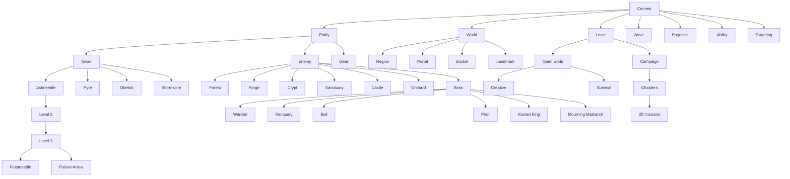

# Reusable game content nodes

`scripts/content/registry.gd` builds the game's content tree. Each node inherits attributes, rules and fresh-instance defaults from its parent. Types override only their differences. The running game uses these definitions through the existing Balance, economy, combat, world and campaign APIs.

These are lightweight `RefCounted` **content nodes**, independent of Godot's visual scene nodes. One definition can serve many live entities, levels and headless simulations. Rendering still owns its `Node2D` objects; saves still contain ordinary dictionaries and stable content IDs. The portal roster update preserves those IDs and refunds retired attunements through the save owner.



The eighteen gear types, eighteen ordinary enemies, six terrain/portal types, four projectile profiles, eight abilities, every tower tier, and every campaign wave have individual entries. Gear composes registered `attribute/` nodes. IDs are namespaced: `tower/heavy` is Obelisk; `enemy/heavy` is Rootbound Revenant. Bosses inherit Enemy in both the content tree and the GDScript class hierarchy.

## Using a node

```gdscript
const Content = preload("res://scripts/content/registry.gd")
var tower = Content.tower("rapid")
var can_build = tower.can_place("plus", true, false)
var fresh_tower = tower.create("42", "1,0", 2)
var upgraded_stats = tower.stats(4, game.tuning, "frostneedle")
var enemy_types = Content.catalog().descendants("enemy")
var specializations = Content.catalog().children("tower/rapid/3")
var mission = Content.level(0).layout()
var spawns = Content.wave(0, 0).schedule()
```

`attributes()` returns an independent deep copy. `rule(key)` reads an inherited rule. `definition(tuning)` applies the owning game's sparse overrides. `make_record(fields)` creates independent mutable instance state. `derive()` keeps the parent's implementation and overrides supplied values. Nested dictionaries merge; child arrays replace parent arrays. Shared catalog tables are recursively read only.

A tower tier node's `stats()` resolves its own tier through the base tower exactly once; its `create()` keeps the original save kind and sets its level/branch. Use `Balance.tower_stats()` for existing tower dictionaries, and the existing Balance helpers for quotes and displayed descriptions.

## Rules and ownership

The Open World Level node owns `starter_radius` and `starter_style`. World generation reserves a two-tile square around the core for ordinary forest regions and their normal portal roster. Ruins stay outside that square, and the connected biome containing the core has no encounter site. Other forest clusters retain their normal boss. Existing saved territory and encounter records remain owned by persistence.

| Family | Shared behavior | Runtime owner |
| --- | --- | --- |
| Tower | Free plus socket on owned land; relic slot; target modes; initial state; tier scaling | Economy authorizes spending, construction, relocation, upgrades and equipment |
| Enemy | Identity, health, movement defaults, escape damage, clean pooled records | Combat owns live enemies, movement and payouts |
| Boss → Enemy | Encounter state; overridable movement speed and damage absorption | Encounter service owns discovery, routing, regeneration and escort timers |
| Gear | Equipment compatibility and independent progress for attached attributes | Relic service owns drops, ownership, effect timing and removal |
| Attribute | Immutable, composable behavior with per-recipient state supplied by its owner | Owning gameplay service executes hooks and cleans removed effects |
| Projectile | Muzzle, flight bounds, impact timing and fresh effect records | Combat owns flight and impact; rendering draws effects |
| Ability | Specialization parameters and resolution against launched tower stats | Ability/projectile services execute effects on the simulation clock |
| Region | Saved terrain identity and fresh history, traffic and unlock state | World service owns geography and routes |
| Portal | Enemy family, exclusivity and biome tuning | Combat owns spawn clocks |
| Socket / landmark | Plus geometry and capacity; landmark properties | World and economy enforce placement and topology |
| Level | Open-world/mode rules or authored campaign layout and allowed sockets | State/campaign run owns progress and saves |
| Wave | Spawn groups and stable schedule ordering | Campaign run advances the schedule |
| Targeting | Per-mode lock policy | Combat owns locks; First/Last keep switching |

Nodes never retain the owning game, visual objects, live enemy dictionaries or mutable progress. Parents point upward; child discovery uses the registry, avoiding parent/child reference cycles. Factories construct records; services still validate ownership, affordability, stale actions and save contracts.

## Shared tower presentation

Both build menu hosts own an independent `ui/towers/build_selection.gd` component. It remembers the last catalog tower and whether its details or the icon picker were open. Selecting another empty socket, closing and reopening the menu, or constructing a tower retains that navigation state; the preview and confirmation resolve against the newly selected socket. Back remembers the selected icon while returning to the picker. A different game instance starts with the first catalog tower and closed details. This transient presentation state is separate from gameplay records, save data and preview cleanup.

Tapping a placed tower opens `VigilTowerDialog`'s bottom upgrade preview in both game modes. It reuses `tower_choice.gd`'s build details with the next registered tier, description and base stats, showing signed changes for every numeric stat plus derived attacks per second and DPS. Unchanged values say "No change"; interval reductions show a minus sign. Level 3 previews either registered specialization without spending; level 4 displays the owned branch with a disabled Max level action. Close returns to the existing tower controls. The pinned Upgrade button uses the owning economy's quoted price, expected level and selected branch, refreshes stale tuning before allowing a purchase, and preserves the usual affordability, rebuilding and persistence checks. Preview state belongs to the dialog and does not alter tower records or equipment.

All dropdown choices use `ui/shared/illustrated_picker.gd`: a bounded scrolling popup with passive artwork/name columns and a separate selection button. Content owners supply stable IDs and `content_portrait.gd` previews; campaign spawn groups choose the Enemy or Boss renderer from the registered kind. Non-actor choices use `choice_portrait.gd` symbols for slots, levels and rules. The picker owns selection, disabled choices and column alignment; callers retain rule changes, save operations and other transactions.

Attack reach belongs to each Tower content type in `content/catalogs/towers.gd`. Pyre uses 115/129/143 units at levels 1/2/3 to trade reach for splash damage; Ashneedle uses 140/154/168 for rapid single-target darts; Stormspire uses 160/174/188 for multi-target coverage; Obelisk uses 185/201/217 for slow, heavy long-range shots. Level 4 inherits its family's level-3 reach unless explicitly tuned. Combat, placed range outlines, and build previews resolve the same content stats and session tuning. Selecting an icon in either build menu opens its details and previews that tower at the empty socket, including the configured range outline. Returning to the icon picker clears the preview.

Campaign and Infinite build menus use `ui/towers/tower_choice.gd`'s shared two-step presentation. The `build_list` factory makes a horizontal strip of compact 104-by-94 cards containing only a centered 48-pixel portrait above a 14-pixel title. The reusable `content_portrait.gd` profile factory frames native tower artwork in a medallion tinted from its catalog color. Selecting a card hides the strip and opens the shared `details` view: resolved description, numeric base statistics except range, derived fire rate and per-target DPS. Level-4 specialization descriptions appear only in the shared information dialog for a placed level-3 tower, alongside the stage that offers left/right upgrades. The details use a standalone Level 1 heading, resolved description, and a three-column grid of labeled values. Seconds per attack replaces range in the build grid, without a separate timing line; upgrade previews retain range and their timing comparison below the grid. The exact price appears once in the pinned Build action. Future numeric fields reuse the grid with labels and units from the tuning schema. Both hosts fit the full details to their content at supported phone sizes without scrolling. Hosts pin Back and Build outside the details; Back restores the same icon and scroll position, and construction stays in each mode's economy owner. The picker has no Build action before selecting a tower. The factory enumerates `Balance.TOWERS`, so registering a base tower automatically adds its icon and details in both modes without editing either host.

Tower upgrades use the shared `rendering/effects/construction_effect.gd` presentation component in both game modes. Each battlefield owns independent transient effects; `play` replaces an effect at the same socket, `remove` removes one, and `clear` cleans up when the economy changes. Sales and relocation remove the old owner's effect immediately through the existing economy presentation signal. A solid dust silhouette covers the tower and its full socket platform during the swap, then shrinks to reveal the result without any departing particles. Its 0.5-second clock uses real frame time, independent of pause and simulation speed. Rendering owns the entire effect; gameplay upgrades stay immediate and no animation state is saved.

The shared tower actions frame their map-space buttons and full yellow range circle through the battlefield's reusable `camera_framing.gd` presentation component. Each battlefield owns an independent 0.4-second smooth transition, constrained by its existing camera limits. Selection, layout, range and upgrade changes can request framing above the pinned upgrade caption; manual pan/zoom cancels it. Zoom stays unchanged unless the circle or controls are larger than the available space, in which case the same transition zooms out just enough to fit. Button layout and transactions remain in their existing owners, and no camera animation state is saved.

The battlefield also owns an independent `rendering/build_preview.gd` presentation component. Opening a build menu immediately previews the remembered tower at the selected socket with 70% opacity in both Creative and Survival, in Campaign and Infinite Worlds. On the first opening for a game instance, the shared tower choice catalog supplies the initial kind and the icon picker stays open until an explicit choice reveals details and Build. Later openings restore the remembered menu page. The preview draws the selected base tower with the existing sentinel renderer and frames the tower and full range above the build menu using the same camera transition. The icon strip keeps its compact height; selected tower details fit their full content while the confirmation stays pinned. During preview, a wider overview is allowed within camera bounds; the shared component derives a temporary camera margin from the tower range and the space above the menu so the full range remains visible on short screens. Closing, construction or changing panels clears the preview, and manual camera input cancels the drift. Preview selection never creates gameplay records or spends gold.

Campaign and Infinite Worlds instantiate the same `VigilTowerActions`, `VigilTowerDialog`, relic picker and tower move components. The campaign screen supplies the active mission's `game` and `field` plus the host callbacks for persistence, selection and feedback. The shared dialogs accept a `Control` host rather than requiring the Infinite Worlds application. Add tower menu features to these shared components, never to a separate campaign management dialog. Campaign only owns its authored socket validation and construction entry point; upgrades, specialization confirmation, equipment, targeting, sales and relocation remain shared transactions. Mission inventory stays isolated from Infinite Worlds, and campaign completion persistence retains its existing semantics.

Campaign Level nodes attach the reusable `investment_refund` attribute in the `setup_refund` slot. Each fresh campaign run gives its economy that definition only during initial setup; starting the first wave removes it permanently for that run. The economy owns attachment/replacement/removal and resolves both sell previews and payouts, including tower upgrades. Later planning phases and open-world sessions use the normal refund. Complete Campaign slots now save planning state or the current wave's starting checkpoint. Reconstruction attaches setup refunds only for initial planning and removes them when restarting a wave.

## Reusable build contents and menu components

The `build_contents` family in `content/catalogs/build_groups.gd` registers common selection groups. Each `BuildGroupNode` declares its game-type applicability, label and tuning category. It discovers registered types and captures their values. `ui/shared/contents_checklist.gd` owns only one form's selection/expansion state. Enemy, Boss and Tower are independent selections; adding a registered type makes it discoverable without adding a menu branch. Base tower selections include their registered tiers. `tests/unified_persistence_runner.gd` registers derived enemy, boss and tower fixture types and verifies that they appear, serialize and exclude siblings.

`persistence/reusable_build.gd` owns sparse composition, companion-content checks and fresh-game defaults. `CampaignSlots` owns complete three-slot Campaign documents, `DocumentStore` supplies checksummed storage, and `cloud/private_backups.gd` owns per-account revision acknowledgements, retries and conflicts. UI pages do not implement save validation or apply portable builds to an existing session. Menu choices, backup acknowledgements and live wave state never live on shared content definitions.

The shared page shell, contents checklist, gameplay toolbar, confirmation popup and mobile layout observer are reusable visual component families. Campaign and Infinite supply their session context to the same navigation owner. Add common menu behavior there and keep authored levels, terrain and gameplay transactions in their existing owners.

Previous-menu actions use `VigilInterface.back_button` or `configure_back_button` for an existing button with connected callbacks. This component preserves the map's 48-pixel square, arrow, font and symmetric padding in every button state. Back buttons sit at the top left of their headers with `SCREEN_PADDING` (12 pixels) inside the screen's safe area or dialog frame and `GAP` between header items. Taller titles and playback controls cannot stretch or vertically center the back button. Hosts retain navigation callbacks; page, toolbar, sheet and nested equipment/campaign dialogs reuse the same presentation.

Wave overviews use `ui/shared/wave_summary.gd` to compose a bordered section, labeled statistics, native Enemy/Boss portraits with counts, and a shared action row. Statistics and enemy identities each sit in a light parchment card built by `VigilInterface.info_card()`, a reusable passive content wrapper that preserves scrolling. Stats use four columns when space permits and two on narrow screens; enemy cards wrap their identity text beside the portrait and count badge. The Campaign screen supplies reports resolved from the Wave content nodes and its navigation callbacks; the component owns presentation only. Detailed balancing comparisons stay in the existing report view, and editing remains gated by the owning campaign mode. Each card has independent controls and never changes a run or shared content.

## Shared mobile navigation components

Screen owners attach `ui/shared/mobile_layout.gd` to refit when display safe areas or orientation change. `VigilInterface.safe_rect` converts physical display insets to the screen's local UI coordinates. The native keyboard overlays the existing UI without shrinking or clipping menu layout. The observer follows focused form controls after display layout changes; its state belongs to that screen and is removed with it.

Every menu scroll area uses `VigilInterface.keyboard_scroll`, which attaches `touch_scroll.gd`. This component lets swipes pass through cards and buttons, opens dropdowns on release, bounds dropdown lists, and restores input settings when content leaves its owner. Nested scrolling and editable fields retain their own input boundaries. Confirmation descriptions and errors share a bounded scroll area with persistent confirm/cancel actions. Android Back dismisses the top popup before navigating the active game menu. Both battlefield types inherit touch cancellation on lost focus and releases intercepted by overlays.

Run `./launch.ps1 -MobileTests` for physical touch events injected through the desktop viewport: both game flows, menus, lists, forms, campaign screens, tower actions, pan/pinch, and safe-area conversion at 360x640, 390x844, 540x960, and 844x390. Physical phone density, native keyboard behavior and OS gestures still require device testing.

## Adding a tower such as Pike

This creates a prototype inheriting Ashneedle's behavior in an isolated catalog:

```gdscript
var prototypes = Content.new()
var ashneedle = prototypes.get_node("tower/rapid")
var pike = ashneedle.derive(
    "tower/pike",
    {"name": "Pike", "damage": 8.0},
    {"kind": "pike"}
)
prototypes.register_node(pike, "towers", "pike")
var record = pike.create("43", "1,0", 0)
```

This also inherits Ashneedle's authored upgrades and branches. Supply different `upgrades`, `branches`, `abilities` and `multipliers` rules when designing another progression. Prototype registration does not automatically add a type to shipped menus or save validation.

To ship a tower, add its rows to `scripts/content/catalogs/towers.gd`: `TOWERS`, `TOWER_UPGRADES`, `BRANCHES`, `PROJECTILES`, and relevant ability definitions. The registry creates the type and descendant tiers automatically. Existing menus and validators use the same source tables through Balance aliases. Add art, audio and new attack mechanics, then test construction, combat, upgrades, equipment and saving. Existing tower names and IDs are preserved; Pike is an extension example, not an added playable tower.

## Other extensions

### Biome bosses

Every region subtype supplies `boss_kind()` from `catalogs/world.gd`'s `BIOME_BOSSES`. Forest uses Briarbound Warden, Ashen Forge uses Cinder Reliquary, Drowned Crypt uses Drowned Bell, Bloodmoon Sanctuary uses Eclipse Prior, Castle Ruin uses Ruined King, and Mourning Orchard uses Mourning Matriarch. Each connected biome cluster has exactly one seeded encounter tile, independent of purchase order. The shared world cluster service uses visible terrain after castle and Orchard overlays, so disconnected patches are separate clusters. Only purchasing the encounter tile awakens its boss. Castle gates retain their discovery encounter; the Orchard uses its seeded entrance. Other tiles in the cluster never awaken additional bosses. The starting core is excluded from encounter selection.

Ruined King and Mourning Matriarch inherit the shared Boss → Enemy node, with distinct stats, knockback resistance and native silhouettes. Their rewards are owned by the shared progression and equipment catalogs. Their sound families are assigned through boss presentation rules. No new special ability or mutable shared state is introduced. Optional future abilities should use attachable components.

On load, per-tile encounters from the previous release are reconciled by cluster. A defeated or escaped encounter completes the entire cluster. Otherwise, the active boss on the seeded encounter tile is retained, falling back to one stable existing source if that tile has not been purchased. Extra active records are removed without gold, kills or relic rewards. Completed records, earned relics and the retained boss's health and route remain intact. Old randomly assigned castle boss identities remain readable. New encounters resolve the owning region's current biome.

The node/component architecture is the default for every future game addition, not only attributes. Follow `AGENTS.md`: identify the reusable node/category and shared rules, reuse or extend existing nodes, and compose reusable objects for the new content or mechanic. Implement optional capabilities once, assign them explicitly to one or more types, and keep mutable state on each live instance. Inheritance supplies the shared category; composition supplies selectable behavior. The current hierarchy is the foundation for that work. The illustrative periodic speed boost has not been added.

- **Enemy:** add stats and assign exactly one biome family in `catalogs/actors.gd` (`FAMILIES`). Every shipped portal has three distinct inhabitants. Inherited `portal_style` identifies the family; `PRESENTATION` composes the drawing renderer and reusable death cue. Optional gameplay capabilities still require attachable component objects. Keep authored campaign and numeric escort IDs stable in `CAMPAIGN_KINDS` and `ESCORT_KINDS`.
- **Boss:** add stats in `catalogs/actors.gd`. For special defenses/speed, extend `nodes/boss_node.gd` and add the script to `BOSS_TYPES`. Warden, Reliquary and Prior demonstrate overrides; Bell uses shared defense behavior. Encounter summons and regeneration remain in the encounter service. Add a gear entry if a relic should drop.
- **Gear:** add stats/presentation and boss drop assignments in `catalogs/gear.gd`, then attach reusable attribute nodes from `catalogs/attributes.gd`. Extend `AttributeNode` for a new behavior. `with_component()` and `without_component()` derive definitions with explicit attachment, replacement and removal; parents remain unchanged. `GearNode` gives each slot independent counters and state. Relic/equipment services execute gameplay and clean effects when removed. See [GEAR.md](GEAR.md) for all eighteen pieces, tuning, save compatibility and extension rules.
- **Level:** add authored missions in `catalogs/levels.gd`. Update campaign count/progression and chapter assignment when expanding the campaign. Layout, allowed sockets and stable wave scheduling are reused.
- **Terrain/portal:** configure `PORTALS` in `catalogs/world.gd` and the matching actor family. Portal nodes expose `unlock_costs()`, `available_kinds(unlocks)`, `spawn_mix(unlocks)` and `choose_kind(unlocks, roll)`; the menu, economy and combat use these same rules. Every unlocked non-castle territory has an enemy portal; the core keeps its receiving portal and castles keep one dungeon portal per cluster. Enemies without a price are active immediately. Purchased IDs, timers and traffic remain per region. Castle portals offer Crypt Sentinel (550) and Sepulcher Colossus (2,000); all three Orchard inhabitants remain immediately available. See `docs/PORTAL_ROSTERS.md` for all rosters and save compatibility.
- **New family:** extend `nodes/content_node.gd`; register the parent before its subtypes. `register_node()` rejects duplicate identities, duplicate category keys and unregistered parents. Connect the family to its owning service and persistence contract before making it playable.

Tuning schemas live in `catalogs/tuning.gd`. Balance remains the compatibility API for editor bounds, validation, display text and prices. Keep one authored source per value; do not copy numeric defaults into new UI or behavior handlers.

## Validation

`tests/content_node_runner.gd` covers inheritance, subtype construction, nested-state isolation, registry guards, placement, equipment, pooling, boss effects and level/wave rules. The same checks run in `tests/test_runner.gd`. Run campaign and save-slot suites for shared level/mode changes. `tools/check_structure.py` checks resource links and dependency boundaries.

## Portable and campaign configuration

`configuration_picker.gd` is the shared local/community selector for portable rules and campaign builds. `VigilSaveSlots` owns typed library storage and envelope validation; the public-build service owns the explicit upload outbox. Campaign shares compose the existing Level/Wave overrides and optionally a tower/equipment loadout validated by the save owner's shared `valid_loadout()` contract. Selection applies independent state to a fresh run of the same level, with no completed waves or account identity. Stats-only shares omit loadouts. Infinite Worlds keeps its existing build and stats formats; the typed community RPC keeps old world browsers compatible.

The `session/start` Level node owns fresh-session resources. Its `starting_gold` field uses the same tuning schema as other gameplay statistics; changing it does not change an existing world's balance. Stat configurations serialize only validated tuning and descriptive metadata. A fresh session composes these rules before creating its world.

Campaign configuration derives authored Level and Wave nodes with sparse per-level and per-wave overrides. The level catalog owns resource and spawn-group field bounds; the editor and validator consume those definitions. Shared `Balance.configuration_value()` resolves effective statistics for both editors and deterministic per-level reports. Campaign progress, campaign authoring configuration and world slots remain separate stores.

Campaign now enters through a setup screen. Its Creative and Survival Level nodes reuse the existing mode rules and shared `mode_picker.gd`; the screen, run service, and editor all enforce authoring availability. Creative may open every level without unlocking Survival progress. Default Survival retains the original completion save; downloaded builds use completion saves keyed by the rules' content hash. `campaign/session.gd` saves the last choice with checksums and recovery candidates, while Creative edits are scoped to the chosen source build.

`campaign_playthrough.gd` composes all twenty existing Level configurations into one typed `campaign` library entry. It freezes effective editable stats at level scope, plus wave differences, groups, counts, lanes, delays, intervals and rewards; optional level loadouts use the existing CampaignBuild validator. Completion, live enemies and account identity never enter the export. The existing shared library, picker, export panel, public upload outbox and cloud RPCs handle the full campaign alongside legacy single-level builds and Infinite Worlds. Survival imports fresh mission state and cannot mutate the downloaded rules.

Live Creative edits use `Run.apply_configuration()`. Wave nodes provide group/member identities; each run tracks how many members have spawned, preserving existing enemies and the wave clock while rebuilding only outstanding spawns. Saving repeatedly cannot respawn past members. Active groups keep their positions (edit remaining counts instead of deleting a group); future waves allow group removal. Starting gold and core integrity changes apply in initial planning or on restart. The same level/wave stat editor works during combat and between rounds, and saved changes are included in full campaign exports. The Enemy family's `authored_paths` rule makes every registered road enemy available to authored campaign spawns; stock wave rosters and Infinite portal assignments remain unchanged. `tests/campaign_playthrough_runner.gd`, `tests/rendered/campaign_setup_runner.gd` and `supabase/tests/campaign_playthrough_contract.sql` cover runtime isolation, replay, phone layouts and cloud publication/readback.

Campaign core integrity defaults to 3 through the shared Level catalog. Its configuration label also supplies the briefing stat caption. Existing configuration and export keys remain stable, so saved custom integrity values still apply.

Poison Arrow retains the stable `thorn_volley` branch ID. Its Ability node composes the existing `attribute/damage_over_time` component; gear and other assigned abilities can use that same behavior. Component configuration is captured at projectile launch, while each target stores its own timed effect under the source tower and component slot. Repeated hits from one source refresh that effect; independent sources remain independent. Removing or replacing the component, changing specialization or removing its owner expires its effects. Legacy spread fields remain accepted for compatibility but are retired from editable fields and effective-stat reports.

Developer type and tier selection composes the shared illustrated_picker.gd button/menu component with content_portrait.gd native artwork. Callers supply choice metadata and a preview factory; the picker owns scrolling, row separators, selection and focus. Developer transactions stay in the editor and all picker state belongs to its own instance.
