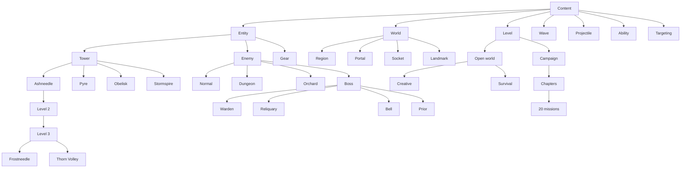

# Reusable game content nodes

`scripts/content/registry.gd` builds the game's content tree. Each node inherits attributes, rules and fresh-instance defaults from its parent. Types override only their differences. The running game uses these definitions through the existing Balance, economy, combat, world and campaign APIs.

These are lightweight `RefCounted` **content nodes**, independent of Godot's visual scene nodes. One definition can serve many live entities, levels and headless simulations. Rendering still owns its `Node2D` objects; saves still contain ordinary dictionaries and stable content IDs. No save migration is needed.



The four relics, nine ordinary enemies, six terrain/portal types, four projectile profiles, eight abilities, every tower tier, and every campaign wave have individual entries. IDs are namespaced: `tower/heavy` is Obelisk; `enemy/heavy` is Revenant. Bosses inherit Enemy in both the content tree and the GDScript class hierarchy.

## Using a node

```gdscript
const Content = preload("res://scripts/content/registry.gd")
var tower = Content.tower("rapid")
var can_build = tower.can_place("plus", true, false)
var fresh_tower = tower.create("42", "1,0", 2)
var upgraded_stats = tower.stats(4, game.tuning, "frostneedle")
var enemy_types = Content.catalog().descendants("enemy")
var specializations = Content.catalog().children("tower/rapid/3")
var mission = Content.level(0).layout()
var spawns = Content.wave(0, 0).schedule()
```

`attributes()` returns an independent deep copy. `rule(key)` reads an inherited rule. `definition(tuning)` applies the owning game's sparse overrides. `make_record(fields)` creates independent mutable instance state. `derive()` keeps the parent's implementation and overrides supplied values. Nested dictionaries merge; child arrays replace parent arrays. Shared catalog tables are recursively read only.

A tower tier node's `stats()` resolves its own tier through the base tower exactly once; its `create()` keeps the original save kind and sets its level/branch. Use `Balance.tower_stats()` for existing tower dictionaries, and the existing Balance helpers for quotes and displayed descriptions.

## Rules and ownership

| Family | Shared behavior | Runtime owner |
| --- | --- | --- |
| Tower | Free plus socket on owned land; relic slot; target modes; initial state; tier scaling | Economy authorizes spending, construction, relocation, upgrades and equipment |
| Enemy | Identity, health, movement defaults, escape damage, clean pooled records | Combat owns live enemies, movement and payouts |
| Boss → Enemy | Encounter state; overridable movement speed and damage absorption | Encounter service owns discovery, routing, regeneration and escort timers |
| Gear | Equipment compatibility and attack progress; overridable attack effect | Relic service owns drops, ownership and effect timing |
| Projectile | Muzzle, flight bounds, impact timing and fresh effect records | Combat owns flight and impact; rendering draws effects |
| Ability | Specialization parameters and resolution against launched tower stats | Ability/projectile services execute effects on the simulation clock |
| Region | Saved terrain identity and fresh history, traffic and unlock state | World service owns geography and routes |
| Portal | Enemy family, exclusivity and biome tuning | Combat owns spawn clocks |
| Socket / landmark | Plus geometry and capacity; landmark properties | World and economy enforce placement and topology |
| Level | Open-world/mode rules or authored campaign layout and allowed sockets | State/campaign run owns progress and saves |
| Wave | Spawn groups and stable schedule ordering | Campaign run advances the schedule |
| Targeting | Per-mode lock policy | Combat owns locks; First/Last keep switching |

Nodes never retain the owning game, visual objects, live enemy dictionaries or mutable progress. Parents point upward; child discovery uses the registry, avoiding parent/child reference cycles. Factories construct records; services still validate ownership, affordability, stale actions and save contracts.

## Adding a tower such as Pike

This creates a prototype inheriting Ashneedle's behavior in an isolated catalog:

```gdscript
var prototypes = Content.new()
var ashneedle = prototypes.get_node("tower/rapid")
var pike = ashneedle.derive(
    "tower/pike",
    {"name": "Pike", "damage": 8.0},
    {"kind": "pike"}
)
prototypes.register_node(pike, "towers", "pike")
var record = pike.create("43", "1,0", 0)
```

This also inherits Ashneedle's authored upgrades and branches. Supply different `upgrades`, `branches`, `abilities` and `multipliers` rules when designing another progression. Prototype registration does not automatically add a type to shipped menus or save validation.

To ship a tower, add its rows to `scripts/content/catalogs/towers.gd`: `TOWERS`, `TOWER_UPGRADES`, `BRANCHES`, `PROJECTILES`, and relevant ability definitions. The registry creates the type and descendant tiers automatically. Existing menus and validators use the same source tables through Balance aliases. Add art, audio and new attack mechanics, then test construction, combat, upgrades, equipment and saving. Existing tower names and IDs are preserved; Pike is an extension example, not an added playable tower.

## Other extensions

The node/component architecture is the default for every future game addition, not only attributes. Follow `AGENTS.md`: identify the reusable node/category and shared rules, reuse or extend existing nodes, and compose reusable objects for the new content or mechanic. Implement optional capabilities once, assign them explicitly to one or more types, and keep mutable state on each live instance. Inheritance supplies the shared category; composition supplies selectable behavior. The current hierarchy is the foundation for that work. The illustrative periodic speed boost has not been added.

- **Enemy:** add stats and its normal/dungeon/orchard family in `catalogs/actors.gd`, with unlock/share data when applicable. Add presentation and any new movement behavior.
- **Boss:** add stats in `catalogs/actors.gd`. For special defenses/speed, extend `nodes/boss_node.gd` and add the script to `BOSS_TYPES`. Warden, Reliquary and Prior demonstrate overrides; Bell uses shared defense behavior. Encounter summons and regeneration remain in the encounter service. Add a gear entry if a relic should drop.
- **Gear:** add stats/presentation in `catalogs/gear.gd`; extend `nodes/gear_node.gd`, override `_apply_attack()` and register the script in `GEAR_TYPES`. Shared code handles counters, targets and timestamps. Implement non-attack effects in their owning service.
- **Level:** add authored missions in `catalogs/levels.gd`. Update campaign count/progression and chapter assignment when expanding the campaign. Layout, allowed sockets and stable wave scheduling are reused.
- **Terrain/portal:** update `catalogs/world.gd` and the registry's world population, choosing enemy family and exclusivity explicitly. Portal nodes expose `unlock_costs()` and `available_kinds(unlocks)`; the menu, economy, natural spawning and save validation share these rules. Enemies without an unlock price are available from the start. Purchased IDs stay in each region's `unlocks` array. Castle ruins start with Abyss Shades and offer Crypt Sentinels for 550 gold; Orchard inhabitants remain immediately available. Add generation/art for a new terrain type and retain stable saved style IDs.
- **New family:** extend `nodes/content_node.gd`; register the parent before its subtypes. `register_node()` rejects duplicate identities, duplicate category keys and unregistered parents. Connect the family to its owning service and persistence contract before making it playable.

Tuning schemas live in `catalogs/tuning.gd`. Balance remains the compatibility API for editor bounds, validation, display text and prices. Keep one authored source per value; do not copy numeric defaults into new UI or behavior handlers.

## Validation

`tests/content_node_runner.gd` covers inheritance, subtype construction, nested-state isolation, registry guards, placement, equipment, pooling, boss effects and level/wave rules. The same checks run in `tests/test_runner.gd`. Run campaign and save-slot suites for shared level/mode changes. `tools/check_structure.py` checks resource links and dependency boundaries.
