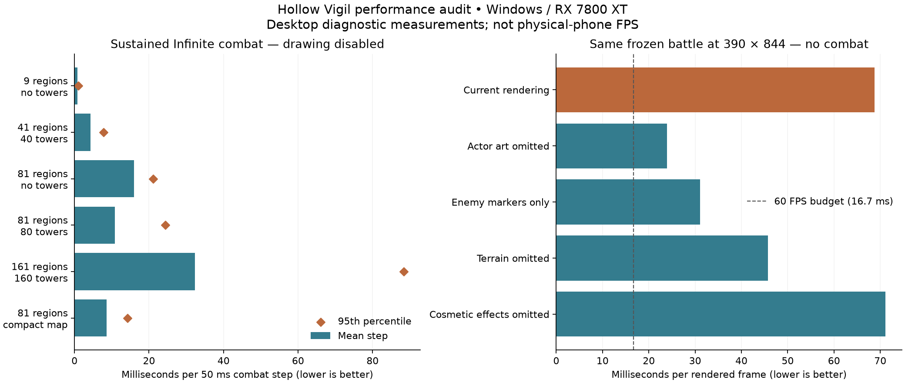

# Hollow Vigil performance audit — September 8, 2026

The measurements identify two substantial costs: drawing large numbers of small pieces of artwork, and repeatedly calculating enemies' remaining route distances during targeting. Keep combat independent of the camera. Optimize those shared systems so both Campaign and Infinite benefit while offscreen kills and rewards remain real.

Physical-phone measurements remain outstanding. No Android device was listed by `adb devices -l`; this Windows host has no Xcode/iOS profiling tools or supplied Mac connection. The results below are desktop measurements, not iPhone or Android performance claims.

## What was measured

| Recommendation | Work performed | Status |
| --- | --- | --- |
| Separate combat from drawing | Six Infinite workloads, three baseline repeats each; coarse phase profiling and deeper function attribution | Completed |
| Measure drawing and GPU work | Both modes at 360×640, 390×844 and 540×960; close, overview, edge and moving cameras; CPU/GPU timers and draw-call counts | Completed |
| Measure visual alternatives | Same frozen state with actor art omitted, enemy markers, map omitted, and transient cosmetics omitted; fully hidden view supplement | Completed |
| Measure interface cost | Full application shells, HUD calls and view maintenance; simulation/render/HUD ablations, three repeats | Completed |
| Test normal playback | Five-second normal-loop samples, three repeats per mode at 390×844, actual elapsed time and audio-event work | Completed |
| Check the available save | Read-only source inspection; benchmarked a private copy of the local 3-region / 2-tower Infinite save | Completed; large reported save was not present locally |
| Inspect repeated calculations | Route distances, speed resolution, enemy index and ID maps, tower stats, component synchronization, visibility queries and atomic save writing | Completed |
| Check camera-independent outcomes | Both modes watching, away and moving; additional rendered full/hidden/HUD-disabled state comparisons | Completed |
| Cover Campaign content | All 30 levels attempted with existing reference strategies; separate sweep measured 144/144 authored waves | Completed |
| Measure real iOS and Android devices | Device/tool availability checked | Blocked by device and Mac access |

## Environment and method

The fixed source baseline is `c5a0b284c74ad55cce6ca375bd14afc9e82fb0a2`, the committed version at the start of this audit. Other tasks were changing the shared checkout, so benchmark copies under `.runtime/performance-audit-20260908/` isolated the measurements. Later ground-placement, level-indicator and menu changes are not included in these numbers. The source-file hashes are saved in [source_manifest.json](performance/2026-09-08/source_manifest.json).

Hardware: AMD Ryzen 7 9700X, 8 reported logical processors, approximately 32 GB installed RAM, AMD Radeon RX 7800 XT. Windows 11 Pro 10.0.26200; discrete GPU driver 32.0.31041.1004. Godot 4.7.2 official desktop executable, OpenGL Compatibility renderer. These are development-executable results, not mobile release builds.

The sustained Infinite tests warm up for 30 simulated seconds and measure the next 15 seconds: 300 steps of 0.05 seconds per repeat. Every region uses maximum configured traffic. Defended fixtures use all eight tower families at level 4; the straight layouts deliberately create long routes. The compact layout contains 81 regions in a 9×9 grid. These are controlled load fixtures, not claims about typical player builds.

The rendered matrix freezes simulation, warms each view for 20 frames, then records 179 consecutive frame intervals. Frame-counter gaps were checked to be one rendered frame per interval. V-Sync and the frame cap are disabled for these diagnostics. CPU/GPU values come from Godot's viewport rendering timers; they can overlap and must not be added to total frame time. Viewport counters are reported as returned by Godot. Drawing-candidate counts include the renderer's 100-pixel margin.

The Campaign rendering stress fixture is level 20 with 500 manually distributed basic enemies and funded maximum-level defenses. It is intentionally separate from authored Campaign wave measurements. The `offscreen` key in the original matrix means a four-tile camera shift; in Infinite it still includes edge enemies. The supplemental `hidden` case moves twelve tiles and verifies zero enemy candidates.

Tables use the median of repeated run means and the median of repeated per-run percentiles. The raw samples retain outliers. Other Godot sessions were active on this shared desktop: a recorded background process used about 86 CPU seconds during a 148-second interval. Only this audit's benchmarks were run serially; other tasks were preserved. Treat the timings as evidence for bottlenecks and relative priorities, not certified hardware limits.

## Sustained Infinite combat

| Infinite fixture | Enemies at 45 s | Mean step (ms) | p95 step (ms) | Worst observed step (ms) |
| --- | --- | --- | --- | --- |
| 9 regions, no towers | 155 | 0.82 | 1.02 | 1.26 |
| 41 regions, 40 towers | 473 | 4.30 | 7.75 | 13.06 |
| 81 regions, no towers | 3202 | 15.93 | 21.10 | 38.34 |
| 81 regions, 80 towers | 980 | 10.87 | 24.43 | 41.09 |
| 161 regions, 160 towers | 2003 | 32.28 | 88.40 | 148.87 |
| 81 regions, 80 towers, compact layout | 1041 | 8.66 | 14.19 | 18.60 |

A 60 FPS frame has about 16.7 ms available for all work. Combat runs every 50 ms, but a long combat step still blocks a rendered frame. The largest defended fixture averages roughly 32 ms per step and has much longer spikes. At 2× playback, the same average workload would require more than one second of main-thread combat work per wall second, before rendering. This is a workload estimate, not a measured 2× device result.

The earlier short stress result was not a steady-state limit: it averaged the initial population ramp. Here, 81 undefended regions reach 3,202 live enemies at 45 simulated seconds. The longer measurement window explains much of the difference.

## Rendering is a major bottleneck in both modes

| Fixture / portrait viewport | Frame mean (ms) | Frame p95 (ms) | Renderer CPU mean (ms) | GPU mean (ms) | Draw calls | Enemy drawing candidates |
| --- | --- | --- | --- | --- | --- | --- |
| Infinite / 360×640 | 68.92 | 74.97 | 28.61 | 27.61 | 14,612 | 290 |
| Infinite / 390×844 | 68.77 | 70.51 | 27.81 | 27.86 | 14,828 | 294 |
| Infinite / 540×960 | 61.60 | 63.31 | 25.84 | 24.65 | 13,749 | 263 |
| Campaign / 360×640 | 66.38 | 67.73 | 22.88 | 23.03 | 13,449 | 500 |
| Campaign / 390×844 | 66.24 | 67.38 | 22.69 | 23.05 | 13,449 | 500 |
| Campaign / 540×960 | 66.32 | 67.79 | 22.97 | 23.10 | 13,449 | 500 |

| 390×844 frozen overview | Infinite mean (ms) | Campaign mean (ms) |
| --- | --- | --- |
| Current rendering | 68.77 | 66.24 |
| Enemy drawings replaced by markers | 31.02 | 16.24 |
| Enemy and tower drawings omitted | 23.90 | 7.83 |
| Map layer omitted | 45.71 | 58.58 |
| Transient cosmetic list omitted | 71.15 | 71.84 |

The marker experiment removes detailed enemy bodies and their per-enemy indicators, replacing each with one circle; tower drawing stays enabled. The actor-removal experiment omits both enemy and tower drawing. Map removal includes terrain and map decorations/controls such as portals and pads. Cosmetic removal clears only the transient `combat.effects` list; gameplay fields, traps and traveling projectiles retain their independent owners.

These experiments are diagnostic ceilings, not implemented visual designs or promised speedups. Their savings overlap and cannot be added together. They show why camera culling alone is insufficient: the visible area can still issue thousands of small drawing commands. Godot's [GPU optimization guide](https://docs.godotengine.org/en/stable/tutorials/performance/gpu_optimization.html) explains the cost of many draw calls and the benefit of batching compatible drawing work.

## The strongest combat improvement: cached route lengths

The detailed 161-region profile spends about **14.13 ms per combat step** in `Targeting.distance_remaining()`. This function walks every remaining route segment whenever a target's distance cache is invalidated. Longer expansion routes make this more expensive even when a tower checks only nearby enemies.

For the 980-enemy defended snapshot, calculating every remaining distance took **48.18 ms**. An isolated precomputed-suffix lookup took **0.28 ms**, approximately **173× faster for that calculation**. Maximum observed difference was zero in both tested snapshots. This is not a whole-game speedup and has not been integrated into combat.

Store cumulative remaining lengths with each actual route and combine the cached suffix with the enemy's distance to its next point. Preserve existing routes when the world expands. Validate exact targeting order, ties, knockback, boss route changes and save restoration before adopting it.

Movement is the other large simulation cost. Resolving speeds for 3,202 enemies alone measured about 9.04 ms per full pass. Cache immutable base values by content type and tuning revision, while retaining each enemy's live slow, stun, root and other modifier state. Follow the reusable content/component boundaries rather than putting special cases into individual enemy types.

Secondary measured costs include approximately 0.70 ms to rebuild the 980-enemy spatial index, 0.78 ms to resolve all 80 tower stat dictionaries, and 0.24 ms to synchronize those tower components. Reuse lookups and invalidate configuration caches on upgrades, equipment changes, live tuning and Campaign wave-rule changes.

## Interface, real-time playback and saving

| Mode / full app fixture | Frame mean (ms) | HUD refresh per call (ms) | View maintenance per call (ms) | Battlefield hidden frame mean (ms) |
| --- | --- | --- | --- | --- |
| Infinite | 66.54 | 0.08 | 0.16 | 3.18 |
| Campaign | 64.35 | 0.12 | 0.02 | 1.49 |

HUD refresh cost is small relative to crowded drawing. Suppressing refresh did not provide a clear frame-time improvement in these trials. Event-driven HUD layout is sensible cleanup, but it is not the first remedy for this lag. The UI diagnostic loop applies a fixed 60 Hz workload; its frame timings are service-cost measurements, not real-time gameplay FPS.

The following separate test uses the normal application `_process(delta)` loop, its 60 FPS cap, and real elapsed time. Infinite starts from the warmed compact world. Campaign plays level 30's final authored wave with the funded defense fixture. Audio processing remains active; only the test application's output bus is muted.

| Normal game loop, 390×844 | Median actual desktop FPS | Frame p95 (ms) | Median simulated / wall seconds |
| --- | --- | --- | --- |
| Infinite | 9.8 | 121.42 | 4.90 / 5.05 |
| Campaign | 60.0 | 17.73 | 5.00 / 5.02 |

The copied local save averaged 0.065 ms per combat step. It is too small to reproduce the reported expanded-world lag.

Snapshot validation plus atomic local saving averaged 10.04 ms for the undefended 81-region fixture and 13.89 ms with 80 towers. This can contribute occasional save-time hitches, but not the continuous drawing cost. A later improvement could serialize and write an immutable snapshot off the main thread while preserving validation, atomic replacement and shutdown guarantees.

## Campaign coverage and correctness

The existing reference strategies were attempted on all 30 levels. They lost on levels 3, 7, 9, 12, 14, 16, 17, 18, 19 in this baseline; those results are retained rather than reported as successful playthroughs. To cover the omitted later waves, the separate performance sweep raises only the fixture's core health to 1,000,000, keeps the actual authored schedules, and uses the same purchasing strategy. It measured **144/144 waves**. Its completion is not a balance or player-victory assertion.

| Level | Authored waves measured | Peak live enemies | Mean combat step (ms) | p95 (ms) |
| --- | --- | --- | --- | --- |
| 1 | 3/3 | 10 | 0.07 | 0.14 |
| 2 | 4/4 | 18 | 0.09 | 0.19 |
| 3 | 4/4 | 17 | 0.10 | 0.23 |
| 4 | 4/4 | 11 | 0.08 | 0.15 |
| 5 | 4/4 | 12 | 0.16 | 0.29 |
| 6 | 4/4 | 14 | 0.10 | 0.22 |
| 7 | 4/4 | 19 | 0.12 | 0.25 |
| 8 | 5/5 | 32 | 0.17 | 0.39 |
| 9 | 5/5 | 28 | 0.14 | 0.26 |
| 10 | 5/5 | 30 | 0.13 | 0.22 |
| 11 | 5/5 | 13 | 0.14 | 0.30 |
| 12 | 5/5 | 24 | 0.19 | 0.35 |
| 13 | 5/5 | 22 | 0.18 | 0.38 |
| 14 | 5/5 | 26 | 0.19 | 0.35 |
| 15 | 5/5 | 35 | 0.22 | 0.41 |
| 16 | 5/5 | 16 | 0.20 | 0.41 |
| 17 | 5/5 | 25 | 0.21 | 0.41 |
| 18 | 5/5 | 29 | 0.24 | 0.46 |
| 19 | 6/6 | 50 | 0.27 | 0.54 |
| 20 | 6/6 | 27 | 0.26 | 0.48 |
| 21 | 5/5 | 18 | 0.20 | 0.40 |
| 22 | 5/5 | 18 | 0.25 | 0.49 |
| 23 | 5/5 | 20 | 0.20 | 0.37 |
| 24 | 5/5 | 27 | 0.22 | 0.46 |
| 25 | 5/5 | 16 | 0.24 | 0.48 |
| 26 | 5/5 | 20 | 0.22 | 0.42 |
| 27 | 5/5 | 27 | 0.23 | 0.46 |
| 28 | 5/5 | 26 | 0.23 | 0.43 |
| 29 | 5/5 | 24 | 0.23 | 0.42 |
| 30 | 5/5 | 30 | 0.24 | 0.44 |

The six watching/away/moving camera cases matched for both modes, including live enemy positions and health, pending shots, tower earnings, kills, escapes and balances; Campaign health and phase were also included. Full rendering, a hidden battlefield and suppressed HUD refresh produced the same state in the application fixtures. Stable-content fingerprints across the baseline, coarse profiler and detailed profiler matched for the 81-region, 80-tower, 900-step validation case.

## Recommended implementation order

1. **Reduce the drawing commands needed for the existing art.** Bake reusable enemy/tower body artwork into textures or cached meshes and cache static terrain chunks as rendered images where appropriate. Preserve the current silhouettes, colors and outlines; keep dynamic attacks and status indicators separate. Use shared render owners for both modes, and invalidate terrain caches when their appearance changes. Budget texture memory and verify zoom quality. Grouping compatible sprites or region-local instance batches is worth testing; Godot documents the visibility tradeoff of [MultiMesh batching](https://docs.godotengine.org/en/stable/tutorials/performance/using_multimesh.html).
2. **Replace repeated full-route distance walks with cached cumulative route lengths.** This is the strongest directly isolated combat opportunity and should particularly help expanded Infinite worlds and attack-time spikes.
3. **Reduce per-enemy speed/configuration work.** Cache immutable resolved values, keep runtime status state local to each enemy, and avoid checking inactive effect families unnecessarily. Continue simulating offscreen movement and combat on the same authoritative clock.
4. **Reuse shared lookup tables and tower configuration.** Avoid rebuilding multiple enemy-ID maps in one step; maintain or efficiently rebuild spatial buckets, preserving deterministic ordering. Cache tower stats and component configuration with explicit invalidation.
5. **Address smaller recurring costs after the above.** Refresh HUD layout on changes, cache unchanged camera bounds, and smooth save-time work. Retain the existing bounded cosmetic pool. The current measurements do not justify replacing exact offscreen battles with estimated income.

Threading or scheduled fast-forward of uneventful travel can be evaluated if these changes still miss the device budget. They introduce ordering and event-boundary complexity, so they should follow the lower-risk measured opportunities. Keep cross-tile attacks, projectile travel, status ticks and rewards authoritative.

## Remaining acceptance work

Connect an Android phone with USB debugging and provide an accessible Mac/iPhone profiling setup. On each device, run the same saved fixtures in a release build, record CPU/GPU frame times and p95/p99 stalls at normal and faster playback, pan and zoom in upright portrait, and repeat after sustained play to expose thermal throttling. Record device model, OS, resolution and power mode. These measurements have not been performed.

After implementing optimizations, repeat the same desktop and device workloads and require unchanged seeded combat outcomes. A useful acceptance target is p95 frame time within the chosen 60 FPS or 30 FPS budget on the weakest supported device, with no sustained simulation lag. That is a target to verify, not a result of this audit.

## Evidence and reproducibility

- [Aggregated measurements](performance/2026-09-08/summary.json), [raw combat samples](performance/2026-09-08/baseline_simulation.json), [render matrix](performance/2026-09-08/baseline_render_verified.json), [hidden/cosmetic supplement](performance/2026-09-08/baseline_visibility.json).
- [Detailed combat attribution](performance/2026-09-08/detailed_deep.json), [isolated calculation costs](performance/2026-09-08/baseline_costs.json), [UI measurements](performance/2026-09-08/baseline_ui.json), [normal-loop measurements](performance/2026-09-08/baseline_live.json).
- [Campaign reference attempts](performance/2026-09-08/baseline_campaign.json), [all-wave sweep](performance/2026-09-08/baseline_campaign_all_waves.json), [camera comparisons](performance/2026-09-08/baseline_camera.json).
- Runners: `tests/performance/`. Orchestration: `tools/performance_audit.py`. Aggregation and charts: `tools/summarize_performance_audit.py`. Production game scripts are changed only inside ignored profiling snapshots by the instrumentation tool.

Use Python 3 to run `tools/performance_audit.py prepare`, then `run baseline render --tag _verified`, `run baseline simulation`, `run instrumented simulation`, `batch`, and `completion`. Finally run `tools/summarize_performance_audit.py`. Set `GODOT_PATH` if needed. A different source revision needs a separate snapshot directory; the tool rejects reusing an archive from another commit. Saves and credentials are not copied into the public report.

One early rendering attempt was discarded while checking sampling. The main matrix later hit a typed-array assignment error only in its six cosmetic-removal cases; those cases were rerun after correcting the harness and are supplied by the supplement. The other 90 matrix cases completed. Initial raw state hashes encoded process-local content-object IDs; separate cross-process validation now uses stable content identities. These were measurement-harness corrections, not production gameplay fixes. All resulting comparisons and limitations are reported explicitly.
