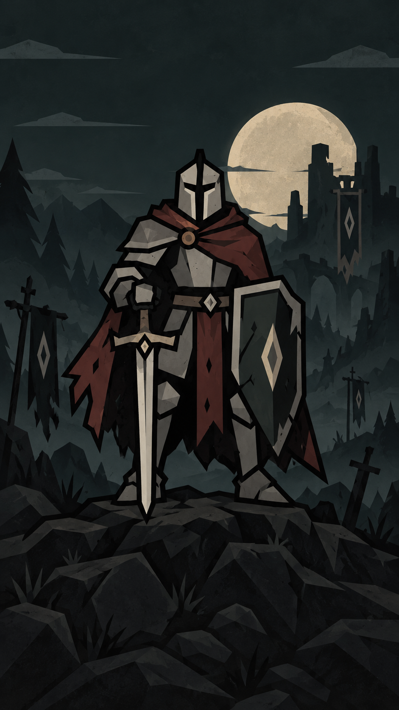

# Hollow Vigil UI style guide

Version 3.2 · Pickard / Moonlit iron · September 16, 2026

## Start with the theme

Read [UI_THEME.md](UI_THEME.md) before creating or changing UI. It is the primary
specification for palette, materials, type, borders, spacing, row actions,
scrolling and review. This guide adds screen recipes and reference interpretation.
Both describe one style, grounded in **the dark Pickard image on the main menu**.

The image's charcoal-green night, angular iron, muted cloak red, parchment moon,
weathered surfaces and strong silhouettes define the UI. The historical bright
Campaign and Settings buttons do not define the palette.
The opening image is the largest source of truth for every future screen.

Version 3 supersedes Version 2's parchment-first backgrounds, yellow primary
buttons and pastel panel defaults. Keep the useful existing card hierarchy,
compact spacing, 1-unit black button borders, 1-unit panel/divider borders,
4-unit corners and mobile input behavior.
Use dark reading surfaces and warm light text as defined in the theme. The shared
runtime now applies these roles across menus and gameplay UI.

## Reference roles

| Reference | Authority |
| --- | --- |
| [Pickard menu background](../assets/ui/pickard-menu-background.png) | Primary mood, palette, material, illustration and composition reference |
| [Original Pickard reference](../assets/ui/pickard-reference.jpg) | Character identity: closed angular helmet, armor, cloak, sword and diamond shield |
| [Waves reference](references/ui-waves-reference.png) | Information hierarchy, compact cards, native portraits and spacing; historical colors and mixed border weights are superseded |
| Current shared UI code | Existing reusable structure, behavior and sizes; old color literals do not override Version 3 |

## Shared implementation

Use `scripts/ui/shared/interface.gd` for primitives and semantic roles. Extend it
and the reusable components before creating local variants. Existing helpers such
as `info_card`, `stat`, `rule`, `action_row`, `number_row`, `button`, `style_entry`
and `keyboard_scroll` preserve structure while their semantic presentation evolves.
The theme's fixed action roles are implemented in that owner: iron for neutral
actions, steel for navigation, violet for editing and bronze for building and
recovery. Their light companions emphasize commitments; cloak red marks danger.
The colors coexist within menus, with no player color selector. Use the shared
role helpers and `UI.button_surface()` so every button retains its 1-unit rim.

Keep text separate from surface tint. Shared world ink/paper/gold constants also
serve artwork, so a UI restyle must not globally recolor terrain or currency.
Update relevant shared consumers and all button/field/popup states together when
implementing dark roles. Keep model values, transactions, save rules and simulation
outside presentation code.

## Typography

Use the shared Grenze family for body text, buttons, fields and statistics, and
Cinzel for major titles and the PICKARD wordmark. Preserve regular, semibold and
bold hierarchy, tabular figures and the currency glyph. Noto remains a fallback
for missing symbols and scripts. Keep existing sizes, wrapping and touch targets.

## Screen recipes

### Main menu and illustrated title compositions

The image fills the viewport with proportional centered cover scaling. Keep live
text above the art: the PICKARD serif wordmark, short THE KNIGHT subtitle and
spare diamond ornament occupy the dark sky. Reserve the middle for the full knight,
including helmet, sword, shield and boots. Actions sit below him over quiet ground.

Current title size responds from 32 to 52; current actions are 56 high, up to 320
wide, with a 14-unit vertical gap. Preserve their layout during future styling.
Campaign uses aged metal and Settings uses steel as defined by the theme. The live controls respect safe areas and stay reachable
through scrolling at short portrait heights. Artwork never owns input and must
not bake text or buttons into its pixels.

Reuse `welcome_menu.gd` and stateless `welcome_art.gd`. Keep the original character
reference unchanged. Asset provenance is in `assets/ui/PICKARD_ART.md`. Other
screens share this dark visual language through their backgrounds, surfaces and
accents; they do not require a full-screen duplicate of the hero.

### Full pages, settings and forms

Use the existing `unified_menu.gd` / `save_slots_panel.gd` shell. Back and title
stay above the scroll area; progression actions stay below. Use 11-unit safe-area
insets and 11-unit separation between these major regions. Keep action order and
current navigation semantics. Do not add feature controls to fill unused space.

For descriptive setting/option rows, put labels and explanations left and values
or action controls right, with a black 1-unit divider below each row. Group
multiple controls at the right and reflow them without reducing 48-unit targets.
Fields remain directly editable; toggles show On/Off. Use the shared form and
numeric rows and preserve a passive area from which to swipe.

Settings, Sound, Account, Bug report, Change log, My builds,
Community, Save build and Backups share this structure. Keep form errors visible after fixed-footer
actions, and preserve first/last-item access when a page rebuilds. Keep Save
privately before Share to Community, and keep publication an explicit action.
My builds details offers Upload build for a private cloud copy. Cloud upload and
recovery controls are explicit; local saves and account changes never schedule backups.

### Cards and saved games

A general card contains a title/status row, optional divider, bold values above
labels, native identity artwork and relevant actions. Use 12 padding, 8 between
cells and 12 between sections. Native portraits remain proportional. Do not
invent empty cells or decorative pictures just to copy a reference layout.

`saved_game_card.gd` separates save name and mode into adjacent cells with an
8-unit gap, allowing the name to wrap while the mode stays content-sized. Preserve
slot state, progress values and action order. The previous blue-gray parchment
page background is an existing color assignment, not the new dark-theme target.

### Choice lists and pickers

Use `UI.action_row()` and `illustrated_picker.gd`. Optional artwork and wrapping
identity stay left; Open or Select stays right, centered vertically. Keep a
consistent action column wide enough for Selected. Draw the divider once below
each row, including disabled/selected rows. Never turn the description into a
full-row tap target that makes scrolling select items.

The picker has a fixed title, Close at the right and a header divider above its
scrolling choices. Fit it inside the owning safe viewport with 11-unit clearance,
up to 480 wide and 560 high. The existing direct-choice save-slot variant sizes
to content and keeps its full-width choices. Reveal the selected item on opening;
restore focus on dismissal. Closing or dragging must not select accidentally.

### Rules and numeric editing

Preserve category → item → full-page editor navigation, illustrated identity,
current tier/branch controls and fixed draft actions. Use the shared numeric row:
wrapping description left, centered 112×48 minimum input right, no stepper arrows,
72 minimum row height and the same divider. Keep defaults and units meaningful.

Default and Added sections retain explicit labels. Group one added rule's heading,
related fields and disable control in one card. As those screens adopt the dark
theme, use restrained semantic markers instead of the older large green/purple
fills. Preserve independent tier/branch state and current editable-field limits.
Retired capability tabs and equipment editing are not authorized by their mention
in historical docs. Back/discard handling must preserve the existing draft model.

### Waves and comparisons

`wave_summary.gd` composes a wave title/status, divider, four stat cells, enemy
roster and actions. Use four columns at 400 available grid units or more, two
below, and additional reflow if needed. Values are bold above their labels.
Roster rows keep portrait and name left, count/state at the right. Editable
quantities remain separate actions; passive content scrolls.

Keep wave timing, counts, health, currency and costs supplied by the model.
Balancing details and editing are separate actions. Comparisons explicitly label
Current and Next, use columns when space allows, and stack at compact widths.
No color alone may communicate a purchase consequence.

### Campaign map and battlefield

The map has fixed Back/title navigation above six edge-to-edge illustrated biome
sections, separated by one black 1-unit line. Preserve chapter scenery, trails,
numbered destinations, unlock/completion states and at least 48-unit level targets.
Keep text clear of full artwork bounds. World illustrations follow the art guide;
map controls use the theme's common dark surfaces and readable text.

Level nameplates fit their text beside each destination instead of stretching
across the scenery. Locked destinations carry the reusable shield-shaped iron
padlock from `locked_emblem.gd`; their accessible names retain the Locked state.
Current, cleared and boss captions remain beneath the title where applicable.

The battlefield keeps its compact top toolbar and three passive information cards
below it: numbered level identity, currency and wave count. Keep those cards in
one row, wrapping text as needed, while gestures pass through to the world.
Reserve camera space for that row. Terrain fills the remaining viewport without
a new outer panel or permanent footer covering play.

The build strip stays bottom-aligned with horizontally scrollable icon squares
at least 48×48, 8-unit gaps and bottom safe-area clearance. Preserve build-choice
memory, direct tower management and the actual current placement behavior.
Do not change tower art or level indicator art as an incidental UI color change.

### Tower panels and confirmation

Preserve the current compact bottom tower-management composition, existing action
availability and identity/level layout. The management card and deeper inspection
pages differ: do not add a Close to the compact card merely because a detail page
has one. Keep existing outside-tap, Back and placement-drag dismissal behavior;
ordinary contextual management leaves the battlefield undimmed.

Detail/upgrade views show identity, current state, relevant statistics, exact cost
or consequence, then actions. Comparisons retain Current/Next labels. Preserve
existing upgrade arming, specialization and model-owned purchase validation.

A blocking confirmation is content-sized and centered inside the safe area, with
consequences above confirm/Cancel. The existing helper normally uses up to 380
width and 16 padding; its long details scroll while actions stay reachable. Only
the top modal receives input, with a single scrim where required. Escape/Back
cancels or closes; a backdrop tap must never confirm or reach gameplay.

### Feedback, input and motion

Use short, actionable feedback near its task. Empty states explain what is empty;
locked states explain the condition; errors offer the actual recovery action.
Keep text legible against dark surfaces without adding warning-color paragraphs.
Preserve the existing earnings badge motion (36-unit rise over 0.95 seconds).

No hover feedback or tooltip. Keyboard navigation stays available without adding
focus rings. Selected states use explicit text or a marker; disabled controls
remain legible. Preserve tap cancellation on swipes and the shared scroll owner's
handling of rebuilt controls. Text entry and slider gestures retain their ownership.
Panel transitions stay restrained, around 180 ms; do not add bounce or pulsing.

## Review and maintenance

Use the checklist and test-owner mapping in [UI_THEME.md](UI_THEME.md). Check
rendered upright 360×640, 390×844 and 540×960 layouts, long labels, large values,
selected/disabled/modal states and safe-area behavior. Run the focused tests in
[tests/README.md](../tests/README.md). Desktop simulation does not establish
physical iOS/Android acceptance.

Check the actual rendered dark palette in every state, including the fixed
iron, steel, violet and bronze actions and their emphasized variants. Use `moonlit_theme_runner.gd` for the complete menu inventory and
contrast/border checks, plus the relevant interaction runners.

Keep this guide, `UI_THEME.md`, `ART_DIRECTION.md` and `AGENTS.md` aligned. After
editing this guide, run `./tools/render_ui_style_guide.ps1` in PowerShell 7 to
regenerate its HTML companion. The theme owns shared visual rules; add screen
recipes here without creating a second competing palette.
