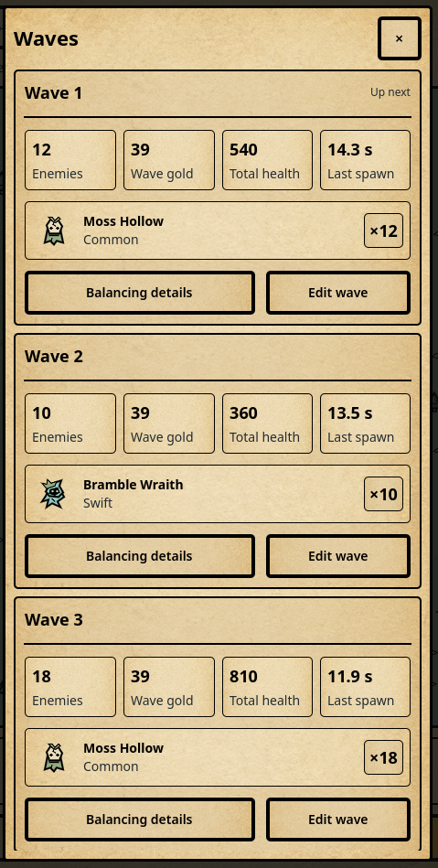

# Hollow Vigil UI Style Guide

Version 2.1 · Parchment cards · September 7, 2026

## Purpose and authority

This guide defines the visual and interaction system for future Hollow Vigil interfaces. Use it when designing screens, adding controls, reviewing UI changes, or giving an implementation agent context. The chosen direction is **ink and parchment dark fantasy**: stark silhouettes, warm parchment, near-square panels, restrained color, and readable information against a bleak world.

The game should feel like a compact illustrated field manual for defending a haunted frontier. Its character comes from native game portraits, warm parchment, uniform black frames, and clear information inside comfortably spaced cards.

This is the ongoing design specification and the default for every future UI request in this repository. Version 2 replaces the older mixed border weights, flat UI fill requirement, and prohibition on individual stat cards. Read it before implementing UI, as required by `AGENTS.md`. `ART_DIRECTION.md` governs terrain and world artwork. Gameplay values and rules remain owned by the game model.

## Approved reference and interpretation

The user supplied the Waves screenshot below on September 7, 2026 and approved its clean cards, information arrangement, illustrations, and spacing. Preserve those qualities across menus, content lists, settings groups, summaries, and detail screens. The requested refinement is one consistent border around every UI enclosure.

The image records the original layout, including its mixed border widths. The standard is **3 UI units of opaque black on every side**, revised at the user's request on September 7, 2026 because the initial 1-unit standard was too thin. Buttons, main sheets, wave cards, badges, and dividers use that same width. Establish hierarchy with spacing, typography, alignment, and restrained fill differences. A passive card remains read-only; its frame does not make it a button. The screenshot's words and values are examples, not instructions or gameplay changes.

## Visual principles

1. Keep the battlefield dominant during ordinary play. Put extended explanations in contextual panels.
2. Give each active task one primary action. In a modal, its confirmation takes priority over the underlying Collect all button, which is blocked and dimmed.
3. Use ink for structure, parchment for reading, and ochre for action. Keep semantic accents small and purposeful.
4. Use the existing shared parchment texture for UI surfaces, including the yellow and red variants for semantic accents. Keep the native portraits flat. Avoid new decorative textures, gradients, metallic bevels, shadows, glow, glass blur, or decorative particles.
5. Make the theme readable at phone size. Short labels, clear silhouettes, and uncluttered grouping carry the fantasy character.

## Color roles

Use semantic names in UI code. The hex values are sRGB; default fills and text are opaque. World colors and UI roles may share a value without sharing a meaning.

| Token | Value | Use |
| --- | --- | --- |
| ink | #000000 | Primary text, structural outlines, icons |
| backdrop | #222A30 | Unowned world and surrounding dark canvas |
| main-menu.background | #283B36 | Deep forest tint on the main menu's shared parchment texture |
| paper | #E8DDBD | Main panels, dialogs |
| paper.saved-games | #B8C4C6 | Campaign and Infinite saved-games page background; retain parchment cards and ink text |
| inset | #DFD0AB | Secondary controls and grouped information |
| text.secondary | #222A30 | Supporting text on paper or inset |
| text.inverse | #E8DDBD | Labels on backdrop; never use black here |
| action.primary | #E0B568 | Primary buttons, active tabs, collection badges |
| action.danger | #DB8D73 | Sell and reset confirmations; always include an explicit verb |
| identity.arcane | #B49DCC | Rifts and arcane identity markers |
| identity.core | #93C9BC | Core identity and recovery illustrations |
| focus.light | #000000 | Reserved ink color; no focus ring |
| focus.dark | #E8DDBD | Reserved paper color; no focus ring |
| scrim | #000000 at 65% | One modal overlay over the inactive scene |

Forest #95AA83, forge #BB8C76, crypt #7FA6AA, and sanctuary #AE879B belong to world identity. Do not recolor the entire UI when the biome changes. Reuse the actual tower and enemy drawings in portraits.

Color needs context. Coral on a flame-tower portrait means tower identity; coral on a button labeled Sell tower means a destructive action. Lavender does not imply rarity, and mint does not mean every positive outcome. Successful actions use a clear message and, for earnings, an ochre badge. Warning text remains ink on a light panel with an icon and explanation. Do not set small text in pale accent colors on parchment.

Target at least 4.5:1 contrast for all essential text and 3:1 for meaningful control boundaries. Check final composited colors, including disabled states. These are project design targets; device accessibility still needs testing.

## Typography

Use **Noto Sans Regular, SemiBold, and Bold** for body copy, controls, and numbers. Use **Noto Serif SemiBold** for screen titles and major object headings at 24 units and above. The serif adds a restrained book-like character; ordinary interface text remains simple. Variable font files and their license notices are bundled in `assets/fonts`; the shared theme selects weights 400, 600, and 700. Keep license notices in exported builds.

| Role | Size / target line height | Weight | Examples |
| --- | --- | --- | --- |
| Compact sheet title | 22 / 28 | Sans 700 | Waves |
| Large screen title | 30 / 36 | Serif 600 | Settings |
| Panel or object title | 24 / 30 | Serif 600 | Ashneedle, Expand territory |
| Section heading | 18 / 24 | Sans 700 | Upgrade effects |
| Card value | 18 / 24 | Sans 700 | Enemies, wave gold, total health |
| Featured value | 24 / 30 | Sans 700 | Spendable gold, unclaimed total |
| Body and controls | 16 / 24 | Sans 400 / 600 | Descriptions, button labels |
| Supporting label | 14 / 20 | Sans 400 or 600 | Damage per hit, current level |
| Compact metadata | 12 / 16 | Sans 600 | Tower class, secondary counts |

Sizes are UI layout units at 1×, not physical panel pixels. Never go below 12 for readable UI text. Costs, error reasons, and action labels use at least 14. Use sentence case; reserve short uppercase labels for metadata such as RAPID. Do not use all caps for long descriptions or buttons. Avoid distressed fonts, blackletter, italics for statistics, and outlined text.

Left-align explanations. Align comparable numbers consistently and enable tabular figures where available. Show units with values: 376 gold, 3.58 / sec, 0.28 sec. Use a stable number formatter and compact large balances consistently. Purchase prices must be unambiguous; show the full exact price in the confirmation even if the HUD abbreviates large totals. Wrapping and reflow take priority over shrinking fonts.

## Spacing and sizing

Use a 4-unit base grid. Approved spaces are **4, 8, 12, 16, 24, 32, and 48**. The compact card recipe uses 4 between value and label, 8 between stat cells or icon and text, 8–12 between sibling cards, 12 inside the outer card, and 12 between its header, stats, illustrated rows, and action row. Use 16 for page padding, 24 inside a spacious dialog, 32 between major page groups, and 48 only for large screen separation. Existing tightly fitted quantity badges may retain 6-unit padding; use the shared 8-unit inset default for new ones.

Screen edge padding is 16 at normal widths and 12 on compact screens, plus device safe-area insets. Main panels use 16 padding; compact summary cards use 12 and their stat cells or illustrated rows use 8. Specify padding in one owning container so StyleBox margins and MarginContainer padding do not accidentally double it.

Standard buttons are at least 48 high, primary footer actions 52, and icon buttons at least 48 by 48. Allow height to grow when text wraps. Maintain at least 8 between touch targets; 12 is preferred in action rows. Icons are 24 by 24 inside their larger hit targets, with 3-unit strokes. Use 48 or 64 portraits for tower and enemy identity.

## Corners and surfaces

| Component | Corner radius | Outline | Fill and treatment |
| --- | --- | --- | --- |
| Edge-to-edge header and footer | 0 | 3 ink | Paper; shared edges drawn once |
| Main sheet or modal | 4 | 3 ink | Paper; no shadow |
| Standard button, tab, or field | 4 | 3 ink | Inset; semantic fill for active action |
| Content card | 4 | 3 ink | Paper or inset; 12 padding |
| Stat cell or illustrated row | 4 | 3 ink | Paper; 8 padding |
| Small badge | 4 | 3 ink | Paper or ochre with ink text |
| Separator | 0 | 3 ink line | Use only between distinct sections |
| Layout-only group | 0 | None | Transparent; no extra frame |

Four units is the maximum corner radius for rectangular UI. Circular core, socket, and expansion markers remain circles because their shape is part of world interaction. Avoid capsule buttons and rounded dashboard styling. The approved nesting is sheet → content card → stat cells or illustrated rows, with a small trailing quantity badge when useful. Add frames only to meaningful groups. A plain HUD value or layout container can remain borderless.

`VigilInterface.OUTLINE = 3` is the single border token. Never introduce a different local border width, including in selected, pressed, disabled, or focused states. Draw abutting shared edges once and keep borders inside their allotted rectangles. These are logical UI units at 1×; display density may map a unit to several device pixels. Use one scale for neighboring controls. Artwork contours and map geometry keep their own stroke rules; an image inside a card is not UI chrome.

Depth comes from occlusion and contrast. A modal has an opaque paper surface over one scrim. Contextual panels do not dim the world. Do not use hover tooltips; show explanations in the interface and retain accessible descriptions.

## Component hierarchy

Build components in this order: **tokens → primitives → reusable groups → screen patterns**. Primitives are text, icon, button, separator, and surface. Groups are a label with a value, a price action, a portrait with identity, a comparison row, and a notification. Screens compose those groups rather than inventing local colors and spacing.

The visual stack, from back to front, is world artwork, world interaction markers, persistent HUD, contextual controls or sheets, modal scrim, modal panel, and modal-local feedback. Only the top active layer receives input. An ordinary world toast must not appear above an unrelated modal or cover its confirmation.

Within a panel, order information as identity, current state, decision-relevant values, cost or consequence, then actions. Body text supports that sequence. A useful hierarchy does not require making every heading larger or every container darker.

## Component recipes

### Standard information card

Use this recipe whenever a screen presents a content item or related summary. Omit blocks that have no useful information; do not add dummy artwork or empty cells to imitate the screenshot.

1. **Header:** left-aligned bold title, with brief status aligned right when applicable. Follow with one standard divider when the body needs separation.
2. **Values:** equally sized stat cells, bold value above its plain-language label. Keep units with values. Reflow four columns to two when the available grid width is below 400 units; stack further for longer content instead of shrinking essential text.
3. **Identity:** native portrait on the left, bold name and supporting role in the middle, compact count or state at the right. Use a 48-unit portrait in a compact row; allow 64–96 for a detail view. Preserve its aspect ratio and show the actual content artwork without a decorative background frame unless needed for contrast.
4. **Actions:** explicit text buttons at the bottom, separated by 12 units and at least 48 high. A longer action may take more width, as Balancing details does in the reference. Stack actions if their labels cannot fit. Passive card content passes drag gestures to the owning scroll container.

Compose `UI.info_card()`, `UI.stat()`, `UI.rule()`, `UI.button()`, and `content_portrait.gd`. `wave_summary.gd` is the implemented reference composition. Reuse this structure for towers, enemies, gear, levels, and other content; keep reports and callbacks supplied by their existing model/service owners. Shared styles contain configuration only; live values and interaction state belong to each control instance.

Saved games uses the shared `saved_game_card.gd` composition in Campaign and Infinite. Put the save name and game mode in separate parchment cards with an 8-unit gap; allow the name to wrap while the mode stays content-sized. Use the muted blue-gray `paper.saved-games` background behind the slot cards, with the existing paper texture and ink text. Other menu pages retain their existing backgrounds.

### Buttons and control states

Primary buttons use ochre, ink text, the same 3-unit border as the surrounding cards, and semibold labels. Secondary buttons use inset. Destructive confirmation uses coral and a specific verb. A simple informational dismissal can use a paper button. Avoid vague labels such as Yes or OK when an action changes gold or progress.

| State | Required presentation |
| --- | --- |
| Default | Semantic fill, ink label and outline |
| Hover | Identical to the resting state; no visual response or tooltip |
| Pressed | No added ring; offset contents down 1 unit without moving the hit area |
| Keyboard focus | No ring or outline; retain keyboard navigation |
| Selected tab | Ochre plus a visible underline or selection marker; not color alone |
| Disabled | Inset fill, secondary text, no hover or pressed response; show reason nearby |
| Pending | Preserve button width, show action-specific progress text, prevent duplicate activation |

Focus can coexist with selected states. Pointer entry must not change fills, outlines, icon colors, cursors, or text. An unaffordable action reads Need 125 more gold nearby rather than relying on fading the control. Disabled elements remain legible without lowering the opacity of the whole subtree.

### Main menu

The main menu is an illustrated night-watch cover: a stacked parchment-colored
serif wordmark, a small mint seal, a moonlit sanctuary landscape above the actions,
and compact footer lettering. Its artwork uses the native drawing library and
never owns input or starts a simulation. Campaign, Infinite and Settings keep
their existing gold-paper treatment, 56-unit height, up-to-320-unit width and
14-unit vertical gaps. At landscape widths, put the identity and illustration
beside the actions; keep the complete composition scrollable on small screens.

### Campaign world map

The detailed landscape revision uses 960-unit chapters with illustrated level
destinations and the existing short chapter story. Compose the Chapter node's
`map_landscape` recipe with the shared architectural and natural drawing kits.
Keep readable text clear of the full scenery bounds, riverbanks and trail
crossings. Artwork may be denser than Infinite terrain; its detail follows the
portals, Moonwheel and Caltrop Keep. Number plaques retain the shared 3-unit border,
and all destinations retain at least 48-unit touch targets. Cleared rubble/beacons,
current pointers, locked labels and fixed Back/Menu controls keep their meaning.
See `ART_DIRECTION.md` for the drawing and rendered validation contract.

The September 7 campaign-map revision is an explicit exception to parchment page backgrounds. Fill the scrolling map edge to edge with the six native Infinite biome colors and scenery. Adjoining chapters share one 3-unit black divider, drawn over trail crossings; omit card frames, rounded chapter corners, parchment gutters and mode availability subtitles. Keep the title and 48-unit Back control in a fixed, safe-area-aware header. Use winding trails that avoid readable level labels and preserve completed, current and locked states. `biome_map_art.gd` owns reusable trail and scenery drawing; `world_map.gd` supplies the authored Level catalog and progression. Validate return navigation, scrolling and label clearance at upright portrait phone sizes with `tests/rendered/campaign_map_runner.gd`.

### Persistent HUD

Campaign levels use one edge-to-edge parchment bar containing Back, Pause, Speed, Waves and Start wave, with 48-unit touch targets and 8-unit gaps/insets. The battlefield fills both sides and the entire remaining screen below it, without an outer parchment frame or footer. Anchor level identity in a content-sized parchment card at its upper left, with separate compact gold and wave cards near its safe lower corners through the shared floating HUD. Use the shared 3-unit ink border, 4-unit corners, 12-unit identity padding and 8-unit value padding. Keep terrain visible between the lower cards, group remaining enemies with the wave count, and let gestures pass through every passive card. Wrap long titles and values within the safe width; use no shadows, glow or terrain-colored label clearings. Reserve space for this information in the opening camera view. Keep remaining enemies visible during play and pause; retain full wave action accessibility labels. Creative sharing remains available inside Waves. Infinite keeps its existing shared toolbar and footer. Put game-specific identity below its toolbar. Menu opens the same full-page navigation and pauses the held session. Resume preserves that live session and its prior pause state. The Infinite footer places unclaimed earnings beside Collect all, with spendable gold, gold per second, and lifetime kills in a lower row. Separate those statistics with alignment and spacing before adding boxes. Shorten visible captions to Gold / sec and Kills when width is limited; retain full accessible names.

Game home, Saved games, New game, libraries, Save build, Backups, Settings and rule drafts use the shared page shell. Keep Back/title fixed above scrolling content and progression actions fixed below it. Full pages render above gameplay frames and short dialogs. Save privately and Share to Community appear together in that order. Use Apply changes and Cancel for rule drafts; the shared contents checklist remains separate from editing the active game. See `UI_MENU_TREE.md` for the complete implemented navigation.

Aim to leave at least 60% of screen height to the battlefield during ordinary play at default text size. When nothing is collectable, keep the layout stable and show No earnings yet. Never collapse the primary action or move neighboring stats as values change.

### Tower selection and details

Selection attaches the existing Info, Upgrade, and Sell actions to the tower context. Keep those actions in a stable order and avoid moving the camera solely to select an object. Clamp the control group inside the visible battlefield; preserve the connection to the tower through placement or a simple pointer. Hide competing tower gold badges while selection or its dialog is active, matching existing behavior.

In Campaign, tapping a tower shows its surrounding controls. Only the yellow Upgrade control opens the shared next-level stat comparison and exact-cost action, including specialization choices at level 3. Hide the surrounding controls while this panel is open; omit the bottom upgrade quote and inline checkmark confirmation. Closing the panel restores the controls. A successful upgrade closes the panel and clears tower selection, including its controls and range circle. A successful build keeps the new tower selected with its surrounding controls. Both successful builds and upgrades return the next empty-slot build menu to the tower cards while retaining the last chosen tower kind. Switching empty slots before building, tower inspection, cancelled actions and failed purchases preserve the existing build-menu page memory.

An information panel shows portrait, tower name, class and level, description, then labeled statistics. Upgrade compares current and next values using explicit Current and Next labels; an arrow may reinforce the relationship. At wider sizes use two columns of statistic groups; at compact widths stack them.

Upgrade confirmation ends with exact cost, projected remaining gold, Cancel, and Upgrade · 376 gold. Values shown in visual examples are illustrative. Read actual values from the model and refresh availability before commit. A sale dialog explains tower removal, refund, and treatment of stored earnings, then presents Cancel and Sell tower. Reset belongs in a separate settings danger section with explicit consequences and confirmation.

### Sheets and dialogs

Context sheets support exploration. Confirmation dialogs support a single decision. Use centered dialogs with a maximum width of 460 units and at least 16 clearance from safe edges. Cap height to the available safe area. Keep heading, close control, and action footer visible while only the body scrolls. Do not nest scroll regions.

Give a single active modal keyboard focus, restore focus to its opener on dismissal, and make Escape or system Back cancel or close. Backdrop taps may dismiss informational sheets; a purchase or destructive confirmation requires an explicit Cancel or close action. Never accept backdrop input as confirmation or allow it through to the battlefield. These are interaction requirements for future implementation, not new claims about current pause behavior.

### Settings

Settings use labeled rows with the value or toggle on the right; stack the control below the label when needed. A toggle must show On or Off as well as its position.

### Developer controls

All five categories share the same editor and header. Keep Back on the left and Close at the top right, with square 48-unit targets, 8-unit header gaps, and matching 3-unit ink strokes. The home title is Developer Controls; each editor uses its category name. Use `UI.fitted_heading` for these titles and the selected object's name: preserve one line, fit between 16 and 24 units, and call `UI.fit_heading` after changing the text. Descriptions and numeric labels wrap at their normal size.

Put the type selector and optional tower tier selector before the portrait and description. The portrait card uses the inset surface, the standard 3-unit outline, 12-unit padding, and a 96-unit art area whose drawing scales proportionally. Keep navigation fixed while the editor scrolls, and return to the top when selecting a new type, tier, or category. Numeric fields, defaults, and reset actions continue to use the shared row components.

### Notifications and exceptional states

Use short feedback such as Tower upgraded to level 7. Collection can retain its existing ochre badge: rise 36 units over 0.95 seconds, then disappear. Ordinary messages remain readable for 3–5 seconds; an actionable error remains until dismissed or resolved. Place feedback above the footer without obscuring actions. Aggregate repeated earnings events.

Empty states say what is empty and what the player can do next. Loading preserves the container size and names the operation. Error states explain the failure and give a recovery action. Locked content states the unlock condition. None of these should invent server loading or progression mechanics that the game does not have.

## Responsive layout and accessibility

Reference layouts are 360 × 640, 390 × 844, and 540 × 960 in effective UI units. At widths below 400, use compact padding, stack comparison columns, and allow footer statistics to wrap. Dialog actions stack when their labels cannot fit; keep the same reading and focus order. Larger windows gain battlefield space rather than stretching text panels indefinitely.

The original build stretched a 540 × 960 canvas. The restyled desktop UI now reflows at the window's size, while mobile uses display-density scaling and safe-area conversion. Do not equate a 48-unit control with a 48-point touch target without checking the final scale on the physical device. World zoom must not shrink HUD text. Tower action controls and gold badges are intentionally anchored in map space and scale with their towers, including their spacing and hit areas. Verify density reporting and touch sizes on supported phones before release.

Respect safe areas on every overlay as well as the header and footer. Test standard text size, long names, large balances, and translated labels that are roughly 30% longer. Increase vertical space or scroll; do not clip, ellipsize purchase consequences, or reduce essential type below the minimum. Hover tooltips are prohibited; use visible labels and accessible descriptions. Icon-only controls require accessible names. Controller or keyboard focus follows visual reading order without drawing a ring.

Hover produces no response anywhere in the app; every action must work by tap and keyboard. Use 120 ms for control feedback and about 180 ms for panel entry or exit. No bounce, camera shake, or continuous pulsing in interface chrome. Use normal motion with a fixed 60 FPS cap; there are no player text-size, power-saving, or reduced-motion settings.

## Implementation and review

Centralize UI colors, type roles, spacing, and surface variants in `scripts/ui/shared/interface.gd` or a dedicated theme resource owned by it. Continue reusing `hud.gd`, `panels.gd`, `tower_actions.gd`, and `tower_dialog.gd`. The shared theme provides structural, content, badge, chrome, and borderless surface helpers. Keep gameplay statistics in `scripts/gameplay/balance.gd`.

Preserve the implemented shared fonts and tokens, readable HUD, responsive comparisons, focus rules, and standard text size and normal motion. Use `./launch.ps1 -StyleTests` for the rendered UI suite, including sixteen style-audit screens at three viewport sizes and Waves at the same upright portrait sizes. Keep this guide and the UI paragraph in `ART_DIRECTION.md` consistent with intentional changes. After editing this Markdown guide, run `./tools/render_ui_style_guide.ps1` in PowerShell 7 to regenerate its HTML companion.

Before accepting a new screen, confirm:

- It uses named roles and the 4-unit spacing scale, with no unexplained local styling.
- Every enclosure and divider uses the same black 3-unit border, including button states; corners and shared edges remain clean at display scaling factors.
- Cards follow the approved value/label hierarchy, show native illustrations when applicable, and retain 8–12-unit gaps at compact widths.
- One primary action is obvious in the active task; destructive actions are explicit.
- Text, cost, state, and consequence are understandable without color or hover.
- Safe areas, compact screens, enlarged text, and large values remain usable.
- Focus navigation works without rings, dismissal is predictable, and modal input cannot reach the world.
- The battlefield, collection flow, tower selection, and model-owned values still behave correctly.
- Updated rendered screenshots cover default, focused, disabled, selected, and modal states. Run `./launch.ps1 -Smoke` for UI behavior; use the broader project checks when changing shared rendering. Verify physical phones separately.

## Reference images and interpretation

The local [Waves reference](references/ui-waves-reference.png) above is the primary layout authority. The older sources below are historical mood references and do not override Version 2's border, texture, or card rules. No third-party artwork is included as a game asset.

- [Darkest Dungeon screenshot in Nintendo Life's review](https://www.nintendolife.com/reviews/switch-eshop/darkest_dungeon): strong outlined silhouettes, dark framing, and controlled warm highlights. Carry over the readable shapes and mood; keep Hollow Vigil's text and controls larger and its fills simpler.
- [Diablo IV inventory screenshot on MobyGames](https://www.mobygames.com/game/204085/diablo-iv/screenshots/windows/1163325/): clear compartmentalization of inventory and character information, with aligned values and restrained framing. Carry over the grouping discipline, while retaining Hollow Vigil's flat artwork and compact portrait layout.

## Context for future UI work

Default to **Parchment cards**, based on the user-approved Waves layout. Use the existing paper texture and palette, one black 3-unit border for every UI enclosure and divider, and 4-unit corners (0 for edge-to-edge chrome). Compose a bold header, values above labels in compact cells, illustrated identity rows when applicable, and clearly labeled actions. Use 12-unit outer card padding, 8-unit inset padding and cell gaps, 12-unit section/action gaps, and 48-unit minimum screen controls. Reflow at phone widths while preserving readable text and scrolling. Reuse the shared interface and portrait components, preserve model ownership, and keep native world artwork unchanged. This is the default for future UI requests unless the user explicitly revises it.
