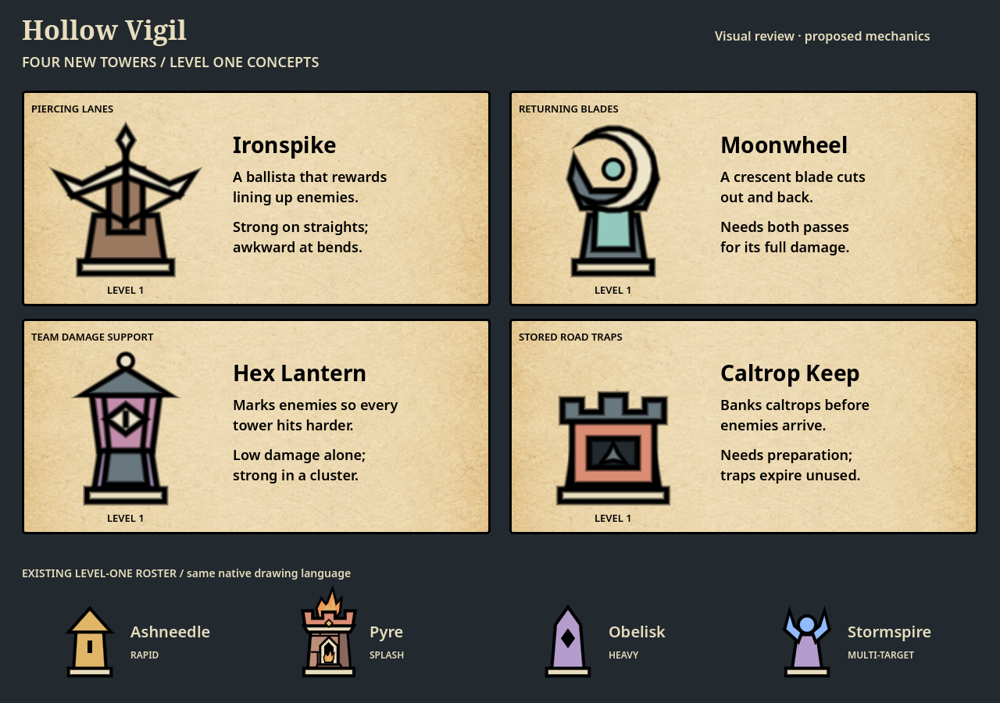
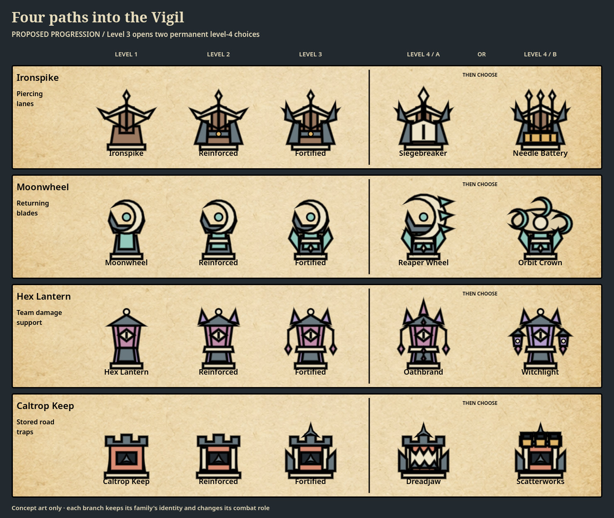

> Historical concept. Hex Lantern live balance was reworked on September 9, 2026; see [current balance](../TOWER_BALANCE.md).

# Four additional tower families

September 7, 2026 · Original visual concept brief · This brief records the proposed designs; its figures are playtest candidates, not a balance certification or implementation status report.

The selected designs now have playable definitions. See [the implementation and current values](../TOWER_BALANCE.md) for live behavior and verification; this document preserves the original proposal.

The original four-tower lineup consists of Ashneedle (rapid single-target darts), Pyre (area blasts), Obelisk (heavy single-target orbs), and Stormspire (up to five lightning targets). Their branches already cover slowing, poison, burning ground, knockback, seeking fragments, repeated-hit curses, lightning arcs, and charged stuns. These four concepts add different decisions: line alignment, return trajectories, team damage support, and storing damage on a road before enemies arrive.

The proposal follows the existing progression: **level 1 → level 2 → level 3 → choose one of two permanent level-4 branches**. Level 4 remains the cap. Each new family would use the same placement sockets, gold, targeting controls, equipment ownership, relocation, and save rules as the existing towers.

## Ironspike — line-piercing ballista

**Level-one appearance:** a low wooden mount, broad bone-colored bow, visible black bowstring, and a single long iron bolt. The horizontal crossbow profile separates it from Ashneedle's pointed roof and Obelisk's upright monolith.

**What makes it different:** one physical bolt continues along a straight trajectory through several enemies. Stormspire can hit enemies scattered around it; Ironspike rewards placing its socket beside a long straight or just beyond a lane convergence. Curved or dispersed traffic limits its value. It aims at a target, then commits to that trajectory rather than steering through later victims.

| Stage | Proposed gameplay | Visual upgrade |
| --- | --- | --- |
| Level 1 | Pierce up to 3 enemies; later hits lose damage. | Wooden ballista, single bolt, bone bow. |
| Level 2 | Pierce up to 4; shorter reload and more reach. | Iron braces, crank collar, reinforced stock. |
| Level 3 | Pierce up to 5; less damage lost between victims. | Wider siege frame and side supports. |
| Level 4 A — **Siegebreaker** | Heavy bolts pierce 3 enemies at full damage and deal a proposed 50% bonus to bosses. A slower reload trades crowd throughput for concentrated damage. | Large bodkin bolt and a bone shield over the winch. |
| Level 4 B — **Needle Battery** | Fire 3 lighter bolts along parallel tracks, each piercing up to 4 enemies. One enemy can take damage only once per volley. Trades single-target punch for wider lane coverage. | Three launch rails and an ochre ammunition rack. |

**Rule to preserve:** each projectile records its own hit IDs. A victim cannot be damaged repeatedly while a bolt overlaps it. An impact is required for damage; no targeting-time damage is added. This is piercing, not an armor-system redesign.

## Moonwheel — returning blade

**Level-one appearance:** a pale crescent blade mounted in a dark fork, above a mint spindle. It has a rounded, open silhouette that none of the current towers uses.

**What makes it different:** the blade cuts through a corridor on its outward journey and follows that same corridor back to its launch point. An enemy can be hit once on each leg. Damage depends on where enemies are when the blade returns; it does not seek new targets or bounce between them. Positioning matters more than target count alone.

| Stage | Proposed gameplay | Visual upgrade |
| --- | --- | --- |
| Level 1 | One blade, up to 3 victims per leg; each victim can take one outward hit and one return hit. | One crescent in a simple fork. |
| Level 2 | Quicker return and shorter cycle; up to 4 victims per leg. | Pale spindle collar and reinforced fork. |
| Level 3 | Wider blade corridor and up to 5 victims per leg. | Mint side guards and a stronger blade cradle. |
| Level 4 A — **Reaper Wheel** | A giant serrated blade cuts up to 8 victims per leg over a longer corridor. Slower throws reward dense, sustained traffic. | Oversized toothed crescent and heavier supports. |
| Level 4 B — **Orbit Crown** | Replace throws with 3 orbiting blades in a short radius. Each enemy can be hit once per shared sweep interval, regardless of how many blades overlap it. | Three small crescents circle a low ring around the spindle. |

**Rule to preserve:** separate outward and return hit sets belong to the live projectile. The base tower has only one blade in flight. Orbit Crown uses a shared damage interval per victim, not three accidental hits every frame. There is no slowing, knockback, or stun. Its short radius is the price of reliable nearby coverage.

## Hex Lantern — team damage support

**Level-one appearance:** a rose-colored lantern with an eye-shaped window, dark peaked cap, and lavender stone foot. The eye is an inset symbol, not a flame or glowing particle effect.

**What makes it different:** a weak curse bolt marks an enemy, increasing damage it takes from all friendly towers. Obelisk's Doomstone increases only its own repeated-hit damage; Hex Lantern helps the entire defense from the first applied mark. Alone it is intentionally a poor damage purchase. It pays off where several towers share coverage.

| Stage | Proposed gameplay | Visual upgrade |
| --- | --- | --- |
| Level 1 | Mark one target for 2 seconds: proposed +12% incoming tower damage. | One enclosed eye lantern. |
| Level 2 | Mark rises to +16% for 2.5 seconds; more reach. | Pale rune collar and two cap finials. |
| Level 3 | Mark rises to +20% for 3 seconds; each pulse can mark 2 targets. | Hanging side charms and a reinforced base. |
| Level 4 A — **Oathbrand** | Concentrate on one target: +35% incoming damage for 4 seconds. Prefer the selected targeting mode; ideal beside heavy towers facing a boss. | Tall central sigil and a single dominant eye. |
| Level 4 B — **Witchlight** | Keep the +20% mark. A directly marked enemy's death spreads it to up to 3 nearby enemies for 3 seconds. Spread marks do not spread again. | Three lantern chambers, with smaller eyes on the sides. |

**Rule to preserve:** only the strongest Hex vulnerability applies; overlapping lanterns never multiply bonuses. Their durations and source IDs remain independent so expiry or removal restores the next valid mark. Direct hits and damage-over-time ticks use the bonus once at damage resolution. The mark itself deals no recursive bonus hit and does not bypass a boss's shield or defenses.

## Caltrop Keep — stored road traps

**Level-one appearance:** a squat coral keep with an iron crenellated hopper and a small caltrop visible in its front chute. It is lower and wider than the other towers, with no flame bowl.

**What makes it different:** it deploys consumable caltrops onto reachable road segments before enemies arrive. A trap arms, waits, and damages the first enemy that touches it. It banks a limited amount of damage between groups rather than directly shooting every approaching enemy. Unlike Cinderfield, its traps neither burn continuously nor damage every enemy in an area.

| Stage | Proposed gameplay | Visual upgrade |
| --- | --- | --- |
| Level 1 | Deploy one single-use trap per cycle; store up to 3, each lasting 8 seconds. | Small keep, one hopper and chute. |
| Level 2 | Store up to 4 traps for 10 seconds; faster deployment. | Pale iron braces and a reinforced magazine. |
| Level 3 | Store up to 5 for 12 seconds; more placement reach. | Side magazines and a large caltrop crest. |
| Level 4 A — **Dreadjaw** | Replace caltrops with powerful single-victim jaw traps; at most 3 active. Each takes longer to arm, rewarding a prepared ambush against durable enemies. | A large toothed jaw replaces the small chute. |
| Level 4 B — **Scatterworks** | Deploy 3 weaker caltrops per cycle across separate road positions; at most 9 active. Covers longer traffic streams with smaller hits. | Three upward-facing hoppers and an ochre magazine. |

**Rule to preserve:** traps never block the road or require new build sockets. Automatically choose valid road positions within tower range and follow the selected targeting mode when traffic is present; use the nearest incoming segment when it is absent. Trap timers use active simulation time. Sell, relocation, branch replacement, and session teardown remove owned traps. Traps cannot trigger before their arming delay or hit more than one victim.

## Suggested level-one starting values

These are initial playtest candidates, not a claim of parity. The current catalog is authoritative; older reference tables may carry earlier tuning.

| Family | Build gold | Hit damage | Cycle | Range | Additional rule |
| --- | ---: | ---: | ---: | ---: | --- |
| Ironspike | 140 | 22 | 1.40 s | 200 | 3 aligned hits at 100%, 70%, 50% damage. |
| Moonwheel | 130 | 10 per pass | 1.50 s minimum between launches | 135 | Up to 3 victims per leg; wait for the active blade to return. |
| Hex Lantern | 100 | 4 | 1.40 s | 270 | One +12% mark lasting 2 seconds, applied after the bolt's damage. |
| Caltrop Keep | 120 | 24 per trap | 2.00 s | 125 | Maximum 3 traps; arm in 0.5 s; expire after 8 s. |

Damage, range and cycle upgrades beyond level one should be tuned using the existing deterministic traffic scenarios. Important comparisons are damage actually delivered, clear rate, investment, and lost damage at bends or between waves; theoretical maximum DPS alone would overstate these towers' value. Hex Lantern needs paired-tower comparisons, and Caltrop Keep needs both prepared and unprepared openings.

## Reusable implementation plan after concept selection

All four inherit the shared Tower content node and plus-sign placement rules. Playable definitions belong in `scripts/content/catalogs/towers.gd`; the registry supplies their inherited level nodes and permanent branch nodes. The preview renderer is separate from that catalog, so reviewing or regenerating these sheets does not register gameplay content.

Compose the new capabilities as reusable attribute/component objects, with configuration separate from live state:

| Proposed component | Recipients | Per-instance state |
| --- | --- | --- |
| Piercing projectile | Ironspike and both branches; reusable by other projectile towers | Hit IDs, remaining victims, traveled segment. |
| Parallel volley | Needle Battery | Volley ID and shared victim set. |
| Target-category damage modifier | Siegebreaker | No mutable shared state; validated target category per impact. |
| Returning projectile | Moonwheel and Reaper Wheel | Travel phase, launch origin, outward and return hit sets. |
| Orbiting attack | Orbit Crown | Rotation phase and per-victim sweep timestamps. |
| Damage vulnerability | Hex Lantern and both branches | Source ID, magnitude, expiry per victim. |
| Mark spread on death | Witchlight | Original/spread provenance to prevent recursive spread. |
| Road trap deployment | Caltrop Keep and both branches | Owned trap IDs, positions, arming, expiry, capacity and deployment timer. |

Attach, replace, or remove these capabilities through their owning services. Never put type-specific combat conditionals in the Tower parent or shared mutable timers in a content definition. Reuse damage resolution, projectile lifetime management, targeting, equipment modifiers, cleanup, and save validation. Rendering consumes effect state, while transactions stay with the economy owner.

Existing stable tower IDs must remain unchanged. Verify component reuse on multiple assigned types, unchanged behavior on unassigned types, independent instances, and cleanup after removal or pooling. Saving should preserve tower identity, level, branch, and normal investment; transient blades, curses, and traps should clear on load, consistent with existing transient combat effects.

## Preview files

- [Level-one concept board](tower-expansion/level-one-concepts.png)
- [All 20 tower stages](tower-expansion/all-levels-and-branches.png)
- [Phone-size review sheet](tower-expansion/phone-390.png)
- Transparent 256 × 256 exports of every stage are in `docs/concepts/tower-expansion/`.

The review-only native drawing code is `tests/previews/tower_expansion/concept_art.gd`; `concept_data.gd` owns preview identities. The generator is `tests/previews/tower_expansion_preview.gd`. These files do not register content, add menu choices, run a simulation, or write progress saves. Render with Godot using `--path . --script res://tests/previews/tower_expansion_preview.gd`, with APPDATA and LOCALAPPDATA directed into `.runtime/tower-concepts/` as in the project launcher. The renderer checks export success, transparent bounds, and unique art for all 20 stages.

Source references: [tower catalog](../../scripts/content/catalogs/towers.gd), [progression contract](../TOWER_BALANCE.md), [node architecture](../NODE_SYSTEM.md), [art direction](../ART_DIRECTION.md), [UI style](../UI_STYLE_GUIDE.md).
