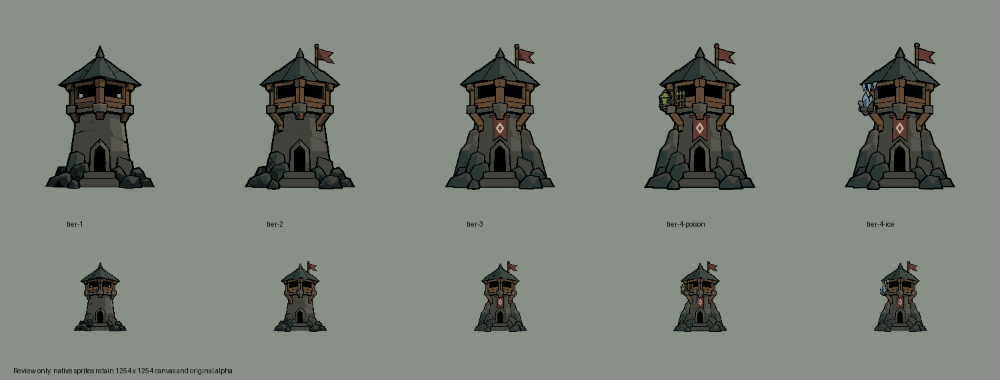

# New Gloamwatch sprite set

Five new transparent sprites, generated with built-in ImageGen using
[IMAGE_GENERATION_INSTRUCTIONS.md](../../IMAGE_GENERATION_INSTRUCTIONS.md)
and [APP_STYLE_THEME.md](../../APP_STYLE_THEME.md).

- [Tier 1](tier-1.png): stone shaft, timber firing loft, dark roof, low rubble.
- [Tier 2](tier-2.png): adds substantial timber braces and an oxblood pennant.
- [Tier 3](tier-3.png): adds stone buttresses and a short diamond banner.
- [Tier 4 poison](tier-4-poison.png): adds a poison reservoir and stored arrows.
- [Tier 4 ice](tier-4-ice.png): adds a mounted crystal cluster and three icicles.

The set ends at tier 4. These are new review assets; the existing runtime artwork
catalog has not been changed. Artwork additions do not change gameplay mechanics.
Each upgrade used the preceding completed image as its edit source. Both tier-4
branches independently used tier 3. Exact prompts are in [prompts.md](prompts.md).

## Shared placement and verification

All five PNGs retain their native **1254 x 1254 RGBA** canvas. ImageGen returned
this size despite the initial 1024-square request; no sprite was resized.
The shared placement anchor is **(621, 1086)**: the horizontal midpoint of the
bottom doorstep front face, with y immediately below its colored face.
Use this same anchor and scale for all five images; do not crop individually.

[finalize.py](finalize.py) corrects only RGB material assignments and applies
integer translation for alignment. It retains the original alpha values and
checks that translation clips no nontransparent pixels. Offsets are zero or
one pixel horizontally, with no vertical movement. Generated edits contain
minor contour variations; common structural pixels are not claimed identical.

The final sweep processes tier 1 first, then normalizes the shared materials of
all remaining sprites to its assignments. Elemental colors are restricted to
their new branch equipment. Every saved file is reopened and checked against
the 16-color palette; seven shared material samples must match tier 1 exactly.
[verification.json](verification.json) records palette, placement, alpha,
material samples, source filenames and final SHA-256 hashes.

The family sheet was visually inspected at large and approximately 100-pixel
tower height. [alignment-preview.webp](alignment-preview.webp) cycles the five
sprites at a fixed placement. Review sheets may be scaled; the five sprite PNGs
retain native dimensions. No gameplay or device tests were needed for these
unintegrated artwork files.

## Exact family palette

| Role | RGB |
| --- | --- |
| Outline and firing windows | #000000 |
| Deep shadow | #151E1D |
| Roof shadow | #293633 |
| Roof lit plane | #414A44 |
| Stone shadow and iron | #41423C |
| Stone main | #56564E |
| Stone highlight | #6D6B60 |
| Timber shadow | #3D3025 |
| Timber main | #624B35 |
| Cloth shadow | #392724 |
| Oxblood cloth | #613B34 |
| Diamond insignia | #BFB295 |
| Ice shadow | #435862 |
| Ice light | #758F9E |
| Poison shadow | #39442B |
| Poison light | #788346 |

Individual sprites use subsets; transparency is separate from the RGB palette.
Original generations remain in the ImageGen output directory. To repeat final
normalization, run `python finalize.py PATH_TO_ORIGINAL_IMAGEGEN_DIRECTORY`.
