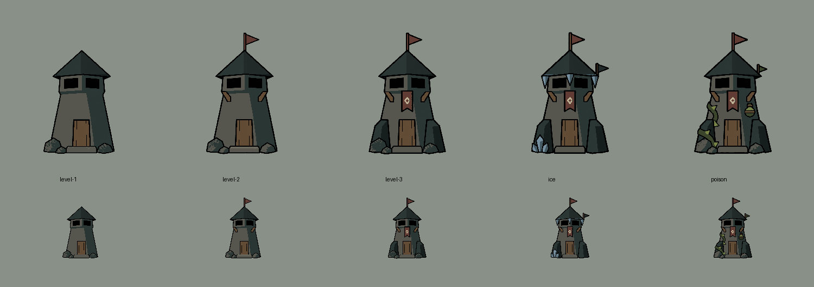

# Simple Gloamwatch family, version 2

Five new concept sprites responding to the request for substantially simpler art.
These are review assets; the runtime catalog still uses the existing Gloamwatch set.

## Design

- [Level 1](level-1.png): plain tapered shaft, pointed roof, two black firing openings, door and low rubble.
- [Level 2](level-2.png): adds two timber supports and a top oxblood flag.
- [Level 3](level-3.png): adds two broad buttresses and a short diamond banner.
- [Ice](ice.png): level 3 with a blue-gray flag, three icicles and a compact ice cluster.
- [Poison](poison.png): level 3 with an olive flag, thorn vine and a strapped poison vessel.

The structure carries identity through silhouette and large planes, with sparse
details and black contours. No visible occupants or baked-in projectiles.
Both branches were generated from the same level-three image.

## Shared placement and checks

All five final PNGs are 1254 x 1254 RGBA, the native generator output size.
Shared placement anchor: **(627, 1094)**, measured at the center of the front
doorstep and the upper edge of its bottom black contour. Canvas center is x=627.
Alignment used integer translation only, with no resampling or clipped pixels.
The generator's requested 1024-square size was not honored; outputs were retained
at native size to preserve geometry.

[verification.json](verification.json) records every source, offset, final anchor
and color count. All visible RGB values belong to the palette below; the original
alpha channel is preserved through color correction and translated intact.
[alignment-preview.webp](alignment-preview.webp) cycles all five at fixed placement.
The family review includes approximately 100-pixel-tall tower silhouettes.
Generated edits retain minor contour variation; this is an aligned concept set,
not a claim that unchanged structural pixels are identical across edits.

## Exact 16-color design palette

| Role | RGB |
| --- | --- |
| Outline and firing windows | #000000 |
| Deep shadow | #151E1D |
| Roof dark plane | #222A29 |
| Stone shadow and roof light plane | #293633 |
| Stone main | #56564E |
| Stone light | #6D6B60 |
| Timber shadow | #3D3025 |
| Timber main | #624B35 |
| Cloth shadow | #392724 |
| Oxblood cloth | #613B34 |
| Diamond insignia | #BFB295 |
| Ice shadow | #435862 |
| Ice light | #758F9E |
| Poison shadow | #39442B |
| Poison main | #566333 |
| Poison light | #788346 |

Individual sprites use a subset. Transparency is separate from RGB colors.
The built-in ImageGen tool produced the artwork using [these exact prompts](prompts.md).
[prepare.py](prepare.py) performs the explicitly permitted color-only correction
and lossless offset adjustment, then produces verification and review artifacts.
It compensates for exposure drift using the same unchanged wall sample in each
source. Raw originals remain in the ImageGen output directory named in the task.
