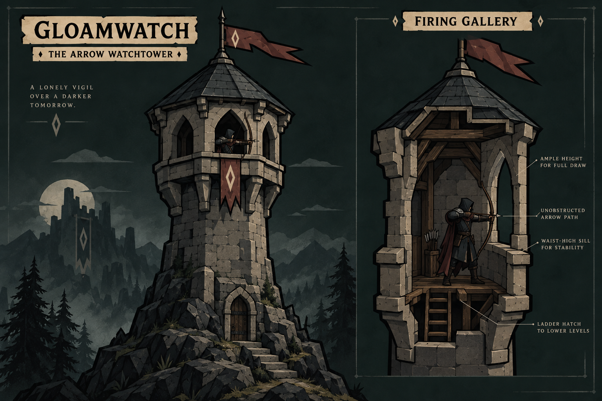

# Gloamwatch — The Arrow Watchtower

Concept proposal, September 17, 2026. This sheet does not replace runtime art,
rename the live catalog, or change combat balance.

## Identity

A lone watchman holds the road from a weathered stone tower, loosing disciplined
bowfire into approaching foes. Swift arrows thin lesser enemies and finish the
wounded. Gloamwatch evokes a watch kept through the fading light: endurance,
isolation, and a human defender rather than an automatic needle launcher.
This description preserves the requested role; it does not add execution damage
or new targeting rules.

## Source hierarchy

- `docs/APP_STYLE_THEME.md`: primary image style, supported by the tier-one tower
  reference and Pickard main-menu image.
- `docs/ART_DIRECTION.md`: world identity and reusable rendering context.
- `docs/UI_THEME.md` and `docs/UI_STYLE_GUIDE.md`: dark UI surfaces, warm readable
  text, compact native portraits, and shared control geometry. Artwork contours
  remain independent of the UI's one-unit borders.
- User-supplied dark fantasy collage: cold slate, lonely archers, aged watchtowers,
  and somber atmosphere. Its photographic treatment and vivid purple/red skies
  do not supersede the project's graphic illustration style.

## Construction and palette

A tapered stone shaft and buttressed rock footing support a projecting covered
firing gallery. Stone corbels carry the gallery; timber supports its slate roof.
Large pointed arches, narrow load-bearing piers, and waist-high sills provide
cover while leaving room to use a longbow. A hooded watchman, a worn oxblood
banner, and a pale diamond connect the structure to Pickard's world.

Use charcoal green shadows, muted cold slate, warm gray stone, dull iron,
dark timber, bone highlights, and restrained oxblood cloth. Preserve broad
facets and heavy silhouettes. The concept's masonry is more detailed than a
phone-sized production asset should be: remove small courses and roof seams
before reducing the gallery opening or the readable bow silhouette.

## Practical firing design

The watchman stands on a continuous timber deck beside a ladder hatch, with
headroom for an upright longbow and space behind the drawing elbow. Arrows
leave at shoulder height through an open arch, above the sill. The cutaway
removes the near wall for explanation; it is not an exposed side in the final
building. Keep the bow limbs clear of the roof and sill.

For implementation, choose the gallery window facing the target and place the
archer and projectile outlet together at that opening. Account for front/back
occlusion; never rotate the building or fire arrows through its piers. A lone
archer changing windows is a presentation abstraction, not extra simultaneous
crew or a new combat mechanic. Validate all target bearings and close targets.
Use a wood shaft, pale fletching, and iron arrowhead rather than a glowing dart.

## Upgrade family proposal

- Tier 1: the essential shaft, covered gallery, watchman, and small banner.
- Tier 2: stronger corbels, iron sill fittings, and reinforced lower masonry.
- Tier 3: broader protected gallery and stronger buttresses; preserve bow space.
- Existing frost specialization: restrained cold arrow and quiver accents.
- Existing poison specialization: restrained mineral-green arrow and quiver accents.

Keep the existing `rapid` save identity and branch IDs. Compose the family in a
shared stateless art owner used by battlefield, build strip, portraits, and
upgrade previews. Before shipping, check those surfaces at 360x640, 390x844,
and 540x960, including the longer display name and directional arrow origins.

## Provenance and review

Created with the built-in image-generation tool using the user collage and the
two project reference images. The exact submitted prompt is in `prompt.txt`.
The generated sheet was visually inspected for style, silhouette, and the
cutaway's floor, access, and bow path. It is an illustrated design explanation,
not a measured architectural drawing or a runtime-tested asset. Generated
captions and scenery are presentation only and must not be baked into a sprite.
