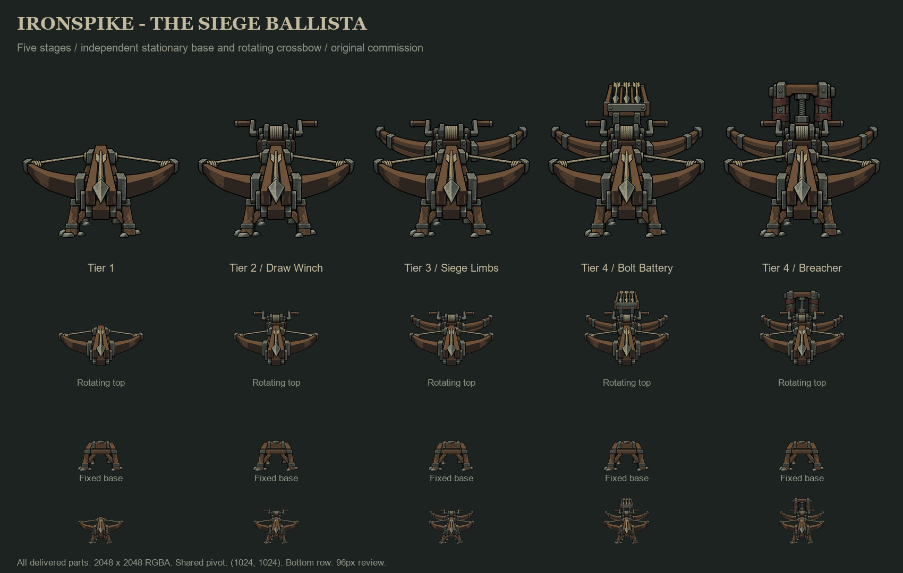

# Ironspike - The Siege Ballista

Original five-stage artwork commissioned September 20, 2026. The design source
is the user's timber-and-iron siege ballista description. No earlier tower
artwork was supplied to ImageGen. The written image-generation and app-style
instructions governed simplicity, material treatment, palette and progression.
The user clarified Ironspike and requested a stationary base plus a separately
rotating weapon assembly.



## Final assets

Each stage has **two independent transparent 2048 x 2048 RGBA PNGs**. The base
is intentionally identical across the family; cumulative upgrades belong to
the crossbow. There are three numbered tiers and two independent tier-4
branches, never a tier 5. Branch names here describe the art concepts.

| Stage | Fixed support | Rotating weapon | Addition |
| --- | --- | --- | --- |
| Tier 1 | [base](sprites/tier-1/base.png) | [top](sprites/tier-1/top.png) | Heavy timber bow, iron bands and one seated great bolt |
| Tier 2 | [base](sprites/tier-2/base.png) | [top](sprites/tier-2/top.png) | Mechanical draw winch |
| Tier 3 | [base](sprites/tier-3/base.png) | [top](sprites/tier-3/top.png) | Additional laminated siege limbs |
| Tier 4: Bolt Battery | [base](sprites/tier-4-bolt-battery/base.png) | [top](sprites/tier-4-bolt-battery/top.png) | Three-bolt magazine with muted blue-gray fittings |
| Tier 4: Breacher | [base](sprites/tier-4-breacher/base.png) | [top](sprites/tier-4-breacher/top.png) | Heavy compression yoke with muted oxblood bindings |

## Placement and rotation

- Shared canvas and core: **2048 x 2048**, center x **1024**.
- Weapon pivot and fixed mounting socket: **(1024, 1024)**.
- Ground anchor: **(1024, 1442)**; same ground-contact row for every base.
- Default weapon direction: **+Y**, toward the viewer/down the image.
- Bolt-tip muzzle marker: **(1024, 1183)**, on the loaded bolt's black tip.

Draw the base without rotation. Draw the top above it, rotating around the
shared pivot. If a target bearing is measured from +X, the top's rotation is
`bearing - PI/2`. Rotate the muzzle's vector relative to the pivot by the same
angle. Apply one shared display scale to both parts; do not normalize their
bounds independently. [placement.json](placement.json) contains the coordinates.

The source images were 1254 x 1254. Final parts use transparent padding and
integer translation, with no resizing or redrawing. The final margins contain
the entire weapon's full rotation circle. This is a flat 2D sprite rotation,
not a collection of perspective-correct camera views.

[Animated rotation preview](rotation-preview.webp) and
[all five stages at eight angles](rotation-review.png) show the fixed base and
independent rotating top. These are offline artwork previews. Runtime integration
uses the same approved parts and placement contract, as described below.

## Palette

The palette was selected and recorded before generation. The first thirteen
colors are common materials. Only the indicated branch additions use the last
three colors. The final PNGs use subsets of this single sixteen-color palette;
transparency is separate. Review sheets and animated previews are resampled
presentation derivatives and are not palette-limited production sprites.

| Hex | Role |
| --- | --- |
| `#000000` | Outline and deep joints |
| `#171B19` | Recess/contact shadow |
| `#292E2B` | Rubble shadow |
| `#484E46` | Rubble face |
| `#717466` | Rubble upper plane |
| `#2C241F` | Timber shadow |
| `#4B392B` | Timber face |
| `#705339` | Timber upper plane |
| `#353937` | Iron shadow |
| `#555B55` | Iron face |
| `#929687` | Worn iron edge |
| `#A59B7A` | Bow-cord lit plane |
| `#685E46` | Bow-cord shadow |
| `#442827` | Breacher binding shadow only |
| `#74453A` | Breacher binding face only |
| `#596C72` | Bolt Battery magazine fittings only |

## Generation and verification

Generated with the **built-in ImageGen tool**. The exact prompt set is saved in
[prompts.json](prompts.json); palette roles are in [palette.json](palette.json).
The initial one-piece source was superseded by the user's split-part request.
Files directly in this folder with `top-`/`base-` names are working layer masters;
only the ten files under `sprites/` are the final paired deliverables.

Each upgrade was generated as an edit of its actual preceding image. Both final
branches independently used the same completed tier-three image. Only selected
generated additions were retained and composited onto the locked earlier
layers. [layers.json](layers.json) records selections, offsets and accent masks;
`sources/` preserves original generated images and `layers/` stores additions
and selection masks. Generator shifts were measured and corrected by integer
translation: tier 2 -59px Y; tier 3 0px; Battery -181px Y; Breacher -171px Y.

[finish_family.py](finish_family.py) performs the explicitly permitted palette
conversion and layer assembly. Its final pass preserves dimensions, positions
and alpha while enforcing the approved color values. Branch accents are limited
to masks over their designated new fittings and bindings. All inherited base
images are pixel-identical; the shared lower bow, stock and loaded bolt remain
pixel-identical across all five weapon images.

After the final save, all ten PNGs were reopened and checked for exact palette
membership, canvas bounds, transparent margins, common ground and core anchors,
and full-circle rotation clearance. All four cumulative layer stacks were
reconstructed and compared pixel-for-pixel. [validation.json](validation.json)
records results and SHA-256 hashes. Visual review covered the whole family,
separate parts, 96px thumbnails and eight angles per weapon.

To recheck using a Python environment with Pillow and NumPy:

```powershell
python finish_family.py verify
```

Godot does not import this concept package (`.gdignore`); it imports unchanged
production copies from `assets/artwork/`.

## Runtime integration

The five fixed bases are copied unchanged to `assets/artwork/tower/ironspike/`,
and the corresponding rotating tops to `assets/artwork/bow/ironspike/`. Tier-4
Bolt Battery supplies `needle_battery`; Breacher supplies `siegebreaker`.
Existing branch names, stats, saves and attack components remain intact.

All ten catalog entries are authored, use 20 pixels per world unit, and retain
the full source canvas. The base entry selects its `rotating_layer`; the shared
projectile definition supplies `aim_pivot` (0, -20.9), `aim_forward` PI/2, and
the unrotated `muzzle` (0, -12.95). Rendering rotates only the top. Combat rotates
the muzzle from that same pivot and records the actual led firing bearing on
the individual tower. Parallel volleys retain their existing lateral spacing.

The cached alpha cutoff removes values below 16 without modifying the PNGs.
Per-stage portrait bounds include both parts, with the default front-facing pose
in menus and build ghosts. Both parts remain authored at high zoom and are
protected from native rebaking. `sentinel_vector` exports the same full pair.

Run `./launch.ps1 -TestScript tests/rendered/ironspike_art_runner.gd` from the
repository root for source identity, mounting, eight directions, actual shot
origins, leading and piercing, independent instances, compact portraits, and
360x640/390x844/540x960 captures. This is desktop rendering and combat simulation;
physical iOS/Android acceptance remains separate.
