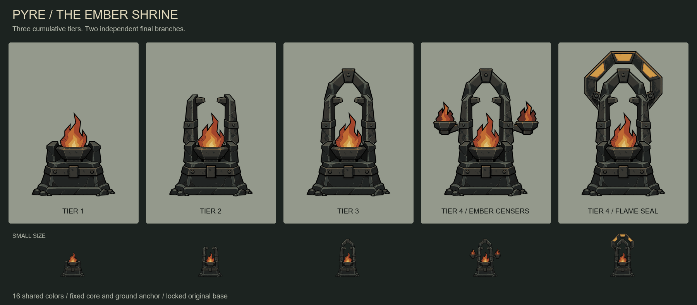

# Pyre - The Ember Shrine

Original tower artwork created from the user's brief:

> A soot-blackened shrine where bound fire magic gathers into blazing projectiles
> that burst among tightly packed enemies. Its identity is a keeper of forbidden
> flame, burning back the darkness at crowded passages.

Generated with the built-in ImageGen tool. No prior tower images or designs were
used as references. The repository's image-generation instructions supplied the
style, five-sprite progression, locked-layer, palette and alignment requirements.
The approved family now replaces Pyre's runtime artwork through the shared
authored-image catalog. Branch names below describe the visual concepts:
Ember Censers maps to Cinderfield and Flame Seal maps to Rupture Pyre. Existing
gameplay, saved identities, branch names and balance remain unchanged.

## Complete family



| Sprite | Cumulative addition |
| --- | --- |
| [Tier 1](tier-1.png) | Soot-black altar, iron binding strap, open captive-flame basin |
| [Tier 2](tier-2.png) | Two stone uprights with inward iron containment clamps |
| [Tier 3](tier-3.png) | Heavy pointed shrine arch with iron keystone |
| [Tier 4: Ember Censers](tier-4-ember-censers.png) | Two bracket-mounted censers holding dark red flames |
| [Tier 4: Flame Seal](tier-4-flame-seal.png) | Mounted iron containment ring with three ochre seal insets |

Both tier-4 branches start independently from the completed tier-3 sprite.
There is no tier 5. The flame is a permanent shrine feature; no airborne
projectile or transient attack effect is baked into a sprite.

## Placement and preservation

- All five transparent RGBA PNGs are **1254 x 1254 pixels**, the native generated
  dimensions. The prompt requested 1024 square for the first image; its actual
  dimensions were retained for all edits and delivery rather than resizing it.
- Fixed core center: **(627, 901)**. Shared ground anchor: **(627, 1130)**.
- Ground y=1130 is the exclusive bottom of the alpha >= 8 silhouette bounds.
  Very faint antialiased edge pixels extend to y=1131.
- The tier-one image is retained in `layers/locked-tier-1.png`. Every nontransparent
  pixel is byte-identical in all five final sprites, including its alpha channel.
- Each upgrade's preceding tier is also preserved byte-for-byte. Spatial masks
  retain only generated additions in previously transparent areas; repainted
  versions of inherited architecture are discarded.
- Before locking the base, a support mask removed isolated near-invisible
  extraction residue. Native edge alpha is retained within two pixels of the
  alpha >= 8 silhouette. Generated source images remain unchanged in `source/`.
- No final sprite is resized, repositioned or redrawn. Review images alone use
  scaled copies. [Alignment playback](alignment-preview.webp) cycles all five
  sprites at the same fixed placement.

## Shared palette

All 16 colors were selected before generation and supplied in every prompt.
Transparency is separate. The same material color assignments persist through
the locked base and cumulative layers; later additions cannot recolor them.

| RGB | Role |
| --- | --- |
| `#000000` | Outline |
| `#111211` | Deep recess |
| `#202322` | Stone shadow |
| `#343936` | Stone face |
| `#4B514A` | Stone bevel |
| `#62665B` | Sparse stone edge |
| `#1C1C1B` | Iron shadow |
| `#363530` | Iron face |
| `#545146` | Iron edge |
| `#67523A` | Bronze shadow |
| `#8A6941` | Bronze face |
| `#622D24` | Ember shadow; censer branch accent |
| `#A2452B` | Ember red; censer branch accent |
| `#C16B32` | Ember orange |
| `#D39B48` | Ochre flame; seal branch accent |
| `#E0BE74` | Small flame core |

## Verification and reproduction

The final deterministic sweep reopens all five saved files, checks every
nontransparent RGB against the selected palette, restores tier-one material
assignments, verifies unchanged alpha, checks exact inherited pixels and zero
core offsets, and verifies common ground placement and clear canvas edges.
See [verification.json](verification.json) for results and
[prompts.md](prompts.md) for the exact generation prompts.

The family was visually reviewed on light and muted backgrounds, side by side
at common scale, and in 128-pixel thumbnails. This is artwork validation, not
in-game or physical-device testing.

Rebuild using Python with Pillow and numpy, from this directory:

```powershell
python prepare.py base
python prepare.py tier-2
python prepare.py tier-3
python prepare.py tier-4-ember-censers
python prepare.py tier-4-flame-seal
python prepare.py finish
```

`layers/` contains the locked base, transparent additions and their masks.
`source/` contains unchanged ImageGen outputs. `.gdignore` keeps these concept
and review files out of Godot's runtime import pipeline.

## Runtime integration

Byte-identical final sprites are installed in `assets/artwork/tower/splash/` as
`1.png`, `2.png`, `3.png`, `4/cinderfield.png` and `4/rupture_pyre.png`.
All five catalog entries use 16 pixels per world unit and full-canvas bounds
`[-39.1875, -70.625, 78.375, 78.375]`, mapping the shared ground anchor to world
`(0, 0)`. The original image pixels, palette and transparency stay unchanged.
The existing muzzle `(0, -29)` aligns with flame pixel `(627, 666)`.
Per-stage portrait bounds fit the full silhouette; authored entries prevent
high-zoom fallback and accidental native rebaking.

Run `./launch.ps1 -TestScript tests/rendered/pyre_runner.gd` for focused runtime
verification and the three portrait-size captures in `artifacts/pyre-*.png`.
